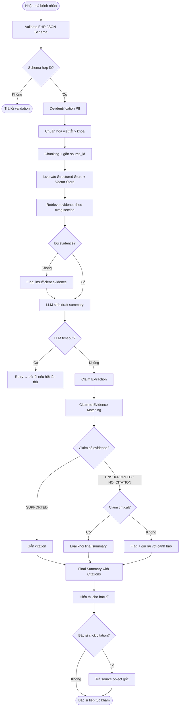
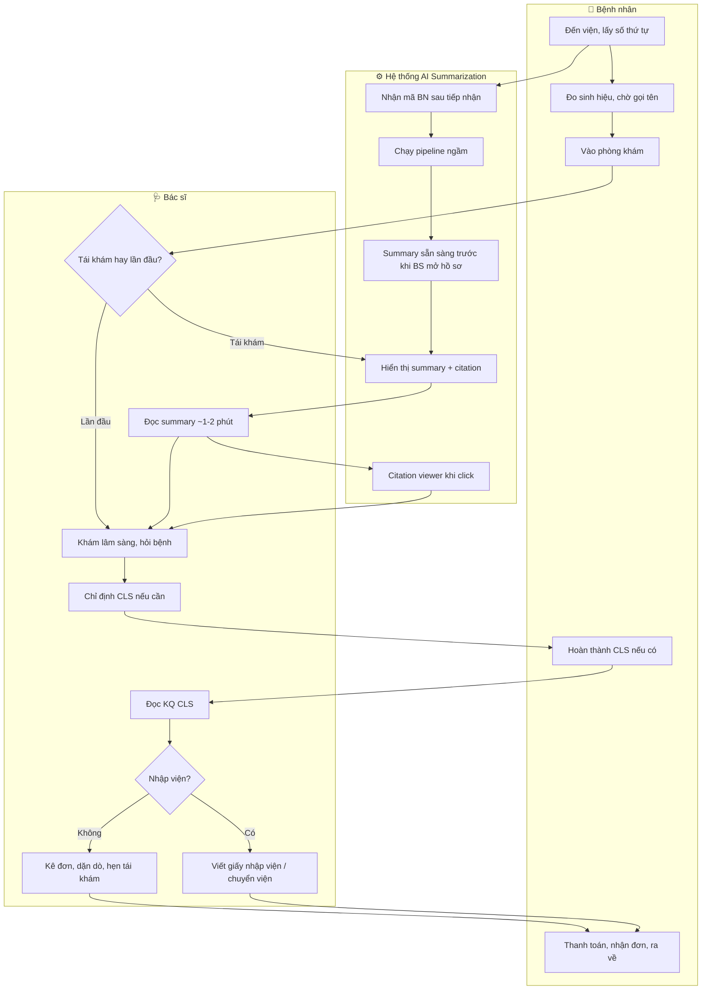
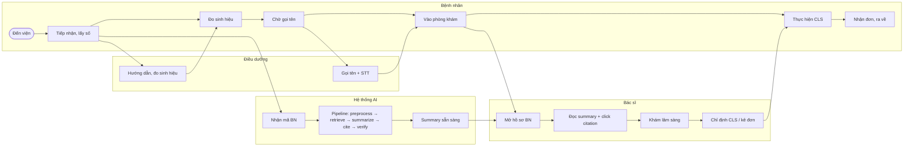

# PRD + Workflow Report: Medical Record Summarization

**Project:** Medical Record Summarization  
**Author:** Đào Anh Quân  
**Strategy:** PARTNER (MVP) → BUILD (Production)  
**Week**: 1  

---

# Mục lục

- [Phần 1: Overview](#phần-1-overview)
- [Phần 2: Users & Context](#phần-2-users--context)
- [Phần 3: Functional Requirements](#phần-3-functional-requirements)
- [Phần 4: Workflow](#phần-4-workflow)
- [Phần 5: System Architecture](#phần-5-system-architecture)
- [Phần 6: BUY / PARTNER / BUILD Strategy](#phần-6-buy--partner--build-strategy)
- [Phần 7: Non-functional Requirements](#phần-7-non-functional-requirements)
- [Phần 8: Scope & Constraints](#phần-8-scope--constraints)
- [Phần 9: Evaluation](#phần-9-evaluation)
- [Phần 10: Acceptance Criteria & Definition of Done](#phần-10-acceptance-criteria--definition-of-done)
- [Phần 11: Open Questions & Decisions](#phần-11-open-questions--decisions)
- [Appendix A — Workflow Diagram](#appendix-a--workflow-diagram)
- [Appendix B — API Specification Draft](#appendix-b--api-specification-draft)
- [Appendix C — Prompt Template](#appendix-c--prompt-template)
- [Appendix D — Reference Data](#appendix-d--reference-data)
  - [D.1 Bệnh án mẫu (BN001)](#d1-bệnh-án-mẫu-bn001)
  - [D.2 Ví dụ output (BN001)](#d2-ví-dụ-output-bn001)
  - [D.3 Từ điển viết tắt y khoa](#d3-từ-điển-viết-tắt-y-khoa)
- [Appendix E — Human Evaluation Form](#appendix-e--human-evaluation-form)
- [Appendix F — References](#appendix-f--references)

---

# Phần 1: Overview

## 1.1 Product Summary

**Medical Record Summarization** là hệ thống tự động tóm tắt hồ sơ bệnh án điện tử thành bản tóm tắt lâm sàng có cấu trúc, có citation truy ngược về nguồn dữ liệu gốc trong HIS/EMR. 

Hệ thống giúp bác sĩ nắm nhanh tình trạng bệnh nhân trước hoặc trong buổi khám mà không cần đọc toàn bộ hồ sơ dài qua nhiều lần khám.

Trong MVP, hệ thống tập trung vào bệnh nhân nội khoa mạn tính, đặc biệt nhóm **tăng huyết áp, đái tháo đường type 2 và rối loạn lipid máu**, với input là EHR JSON tiếng Việt và output là clinical summary tiếng Việt có citation.

## 1.2 Problem Statement

### 1.2.1 Bối cảnh y tế Việt Nam

Bộ Y tế ban hành [Thông tư 13/2025/TT-BYT](#appendix-f--references) *(ban hành 06/06/2025, hiệu lực 21/07/2025)* hướng dẫn triển khai hồ sơ bệnh án điện tử. Đây là **cơ sở pháp lý hiện hành** cho việc lập, cập nhật, hiển thị, ký/xác nhận điện tử, lưu trữ, quản lý, sử dụng và khai thác hồ sơ bệnh án điện tử. Thông tư này cũng thay thế [Thông tư 46/2018/TT-BYT](#appendix-f--references), do đó trong PRD này Thông tư 46 chỉ được dùng như **văn bản tiền nhiệm / tài liệu tham khảo lịch sử** cho các yêu cầu nền tảng về EMR như chữ ký số, bảo mật, phân quyền, mã hóa và audit log. Tuy nhiên, thực tế triển khai còn nhiều thách thức:

- **Mức độ số hóa không đồng đều:** Các bệnh viện lớn tuyến trung ương (Bạch Mai, Chợ Rẫy, ĐH Y Dược TP.HCM) đã triển khai EMR khá đầy đủ, nhưng nhiều bệnh viện tuyến tỉnh/huyện vẫn song song giấy + máy tính (giai đoạn CMR — Computerized Medical Record).
- **Hệ thống HIS đa dạng:** Các phần mềm HIS phổ biến tại Việt Nam bao gồm Viettel HIS, FPT.eHospital, VNPT-EMR, MyHospital, Medisoft HIS — mỗi hệ thống có schema dữ liệu khác nhau, gây khó khăn cho việc chuẩn hóa.
- **Liên thông dữ liệu hạn chế:** Dữ liệu bệnh án thường được quản lý riêng biệt ở các bệnh viện. Bệnh nhân khám ở BV A, chuyển sang BV B phải mang theo bệnh án giấy hoặc giấy chuyển viện.

### 1.2.2 Người dùng cuối

- **Primary user:** Bác sĩ lâm sàng — người trực tiếp đọc summary trước hoặc trong buổi khám. Tại Việt Nam, bác sĩ ngoại trú thường khám 40-60 bệnh nhân/ngày, thời gian thực tế trung bình **10-15 phút/bệnh nhân** (tái khám mạn tính), nên nhu cầu nắm nhanh tình trạng rất cao.
- **Secondary user:** Điều dưỡng, bác sĩ trực tiếp nhận ca — cần nắm nhanh tình trạng bệnh nhân khi giao/nhận ca trực.
- **Context of use:**
    - **Trước buổi khám tái khám** (review nhanh bệnh nhân mạn tính)
    - **Bệnh nhân chuyển viện** (nắm toàn bộ tiền sử nhanh)
    - **Bênh nhân khám các bệnh khác** (một số bệnh, thuốc có thể ảnh hưởng lẫn nhau)

    -> Không thay thế việc đọc bệnh án khi ra quyết định lâm sàng quan trọng.

### 1.2.3 Tại sao cần citation

Trong y tế, mọi thông tin phải chính xác tuyệt đối, có nguồn cụ thể. Summary không có citation sẽ:

- Không thể verify chính xác — bác sĩ buộc phải đọc lại bệnh án gốc hoặc hỏi bệnh nhân --> Mất thời gian tra cứu, bệnh nhân không nhớ rõ...
- Tạo rủi ro y khoa — nếu LLM hallucinate một kết quả xét nghiệm hoặc chẩn đoán, bác sĩ không có cách phát hiện nếu không có source trỏ về. 
- Thông tư 13/2025/TT-BYT yêu cầu hệ thống hồ sơ bệnh án điện tử có khả năng truy xuất, phục hồi thông tin và dữ liệu khi cần thiết để tham khảo, đối chiếu, khai thác, sử dụng trong điều trị, kiểm tra, thanh tra, nghiên cứu khoa học và quản lý y tế. Điều này làm cho **citation, source traceability, versioning và auditability** trở thành các yêu cầu quan trọng của hệ thống Clinical Summarization & Citation Pipeline.

---

## 1.3 Goals & Non-goals

### 1.3.1 Goals

| ID | Goal | Mô tả |
|---|---|---|
| G-01 | Tạo clinical summary có cấu trúc | Summary theo các section quen thuộc với bác sĩ Việt Nam |
| G-02 | Gắn citation cho thông tin quan trọng | Mỗi claim/section quan trọng có source_id trỏ về dữ liệu gốc |
| G-03 | Giảm hallucination | Không sinh thuốc, chẩn đoán, xét nghiệm nếu không có source |
| G-04 | Hỗ trợ bác sĩ review bệnh nhân nhanh hơn | Bác sĩ đọc summary trong khoảng 30 giây – 1 phút |
| G-05 | Build pipeline end-to-end | EHR JSON → preprocessing → chunking → RAG → summary → citation → evaluation |
| G-06 | Có human evaluation | Đánh giá summary bằng rubric thủ công |
| G-07 | Thiết kế có thể mở rộng | Sau MVP có thể mở rộng sang FHIR, HIS thật, voice, image, deployment |

### 1.3.2 Non-goals

| ID | Non-goal | Lý do |
|---|---|---|
| NG-01 | Không tự động chẩn đoán bệnh | Tránh vượt scope sang Clinical Decision Support |
| NG-02 | Không tự động kê đơn | Đây là quyết định lâm sàng cần bác sĩ chịu trách nhiệm |
| NG-03 | Không thay thế việc đọc bệnh án gốc | Summary chỉ hỗ trợ review nhanh |
| NG-04 | Không tích hợp trực tiếp HIS thật trong MVP | Giới hạn thời gian 6 tuần |
| NG-05 | Không xử lý voice/image trong MVP | Whisper và ViT để post-MVP |
| NG-06 | Không làm production compliance đầy đủ | MVP chỉ là prototype/research demo |
| NG-07 | Không xử lý tất cả chuyên khoa | MVP tập trung nội khoa mạn tính |
| NG-08 | Không train model lớn từ đầu | Ưu tiên pipeline, citation và evaluation |

## 1.4 Success Metrics

| Metric | Định nghĩa | Target MVP |
|---|---|---|
| Citation Coverage | % claims có ít nhất 1 citation | ≥ 90% |
| Citation Accuracy | % citations thật sự support claim | ≥ 85% (baseline MVP); target production ≥ 95% |
| Unsupported Claim Rate | % claims không có source backup | ≤ 10% |
| Hallucination Rate | % claims chứa thông tin không có trong source | ≤ 5% |
| Missing Section Rate | % sections bị bỏ trống không lý do | ≤ 5% |
| Human Accuracy Score | Điểm chính xác do người đánh giá chấm | ≥ 4/5 |
| Human Usefulness Score | Điểm hữu dụng lâm sàng | ≥ 4/5 |
| Demo Coverage | Số bệnh nhân demo end-to-end | ≥ 5 cases |
| MVP Latency | Thời gian sinh summary cho 1 bệnh nhân | ≤ 30 giây/case |

---

# Phần 2: Users & Context

## 2.1 Target Users

### 2.1.1 Primary User — Bác sĩ lâm sàng

- **Vai trò:** Người trực tiếp đọc summary trước hoặc trong buổi khám.
- **Bối cảnh:** Tại Việt Nam, bác sĩ ngoại trú thường phải khám nhiều bệnh nhân mỗi ngày, thời gian khám hạn chế.
- **Nhu cầu chính:** Xem nhanh tiền sử, thuốc đang dùng, dị ứng, xét nghiệm bất thường, chẩn đoán gần nhất và điểm cần lưu ý.

### 2.1.2 Secondary User — Điều dưỡng / bác sĩ nhận ca

- **Vai trò:** Người theo dõi bệnh nhân hoặc nhận bàn giao ca.
- **Nhu cầu chính:** Nắm nhanh tình trạng bệnh nhân, thuốc, dị ứng, xét nghiệm bất thường, diễn biến điều trị.

### 2.1.3 Evaluator / Mentor / Product Owner

- **Vai trò:** Người đánh giá chất lượng pipeline.
- **Nhu cầu chính:** Xem summary, kiểm tra citation, đánh giá hallucination, chấm rubric human evaluation, review error analysis.

## 2.2 User Pain Points

### 2.2.1 Pain points chung

1. **Quá tải thông tin:** Bệnh nhân mạn tính (tăng huyết áp, tiểu đường, suy thận) tại Việt Nam thường tái khám hàng tháng. Sau 2-3 năm, hồ sơ có thể có 20-30 lần khám, mỗi lần gồm ghi chú, xét nghiệm, đơn thuốc riêng biệt.

2. **Thông tin phân tán trong HIS:** Dữ liệu nằm ở nhiều module khác nhau trong HIS — module khám bệnh, module xét nghiệm (LIS), module chẩn đoán hình ảnh (PACS/RIS), module dược — không có view tổng hợp xuyên suốt.

3. **Thiếu tóm tắt có cấu trúc:** Hầu hết HIS tại Việt Nam hiển thị dữ liệu theo thời gian (danh sách lần khám), không có bản tóm tắt theo chủ đề (tiền sử, thuốc hiện tại, xét nghiệm bất thường).

4. **Không tin tưởng AI summary:** Bác sĩ Việt Nam chưa quen sử dụng AI hỗ trợ lâm sàng. Nếu summary không có nguồn rõ ràng, khả năng adoption rất thấp.

5. **Rủi ro bỏ sót khi tái khám:** Bệnh nhân có nhiều bệnh nền, thông tin quan trọng (dị ứng thuốc, tương tác thuốc, kết quả xét nghiệm bất thường từ lần khám trước) dễ bị bỏ sót.

6. **Thiếu context liên visit:** Xu hướng thay đổi giữa các lần khám (HbA1c tăng dần qua 6 tháng, huyết áp không đạt mục tiêu liên tiếp 3 lần) khó nhận ra khi đọc từng visit riêng lẻ.

### 2.2.2 Pain points đặc thù Việt Nam

7. **Bệnh nhân chuyển viện:** Khi bệnh nhân chuyển từ bệnh viện tuyến dưới lên tuyến trên, thông tin thường chỉ có giấy chuyển viện ngắn gọn. Bác sĩ tiếp nhận phải hỏi lại bệnh nhân/người nhà toàn bộ tiền sử.

8. **BHYT và mã ICD-10:** Mọi chẩn đoán phải gắn mã ICD-10 để thanh toán BHYT. Đôi khi mã ICD-10 trong HIS không khớp với clinical notes do bác sĩ chọn mã nhanh, tạo inconsistency.

9. **Song song giấy + điện tử:** Nhiều bệnh viện vẫn duy trì bệnh án giấy song song EMR. Một số thông tin chỉ có trên giấy (bản scan), chưa được cấu trúc hóa.

---

## 2.3 User Journey

### 2.3.1 Journey trước buổi khám tái khám

```text
Bệnh nhân đến bệnh viện
→ Lấy số và hoàn tất tiếp nhận
→ Hệ thống nhận diện mã bệnh nhân
→ Pipeline tạo summary trước khi bác sĩ mở hồ sơ
→ Bác sĩ mở hồ sơ và thấy summary
→ Bác sĩ đọc nhanh các section quan trọng
→ Bác sĩ click citation nếu cần kiểm tra dữ liệu gốc, kết hợp trao đổi với bệnh nhân
→ Bác sĩ tiếp tục khám và ra quyết định lâm sàng
```

### 2.3.2 Journey bệnh nhân chuyển viện

```text
Bệnh nhân chuyển từ tuyến dưới lên tuyến trên
→ Bác sĩ tiếp nhận cần nắm tiền sử nhanh
→ Hệ thống ingest dữ liệu có sẵn hoặc file bệnh án đã chuẩn hóa
→ Tạo summary theo timeline và vấn đề bệnh
→ Bác sĩ kiểm tra citation với giấy chuyển viện / bệnh án gốc
→ Bác sĩ tiếp tục khai thác thêm thông tin còn thiếu
```

### 2.3.3 Journey human evaluation

```text
Evaluator chọn case bệnh nhân
→ Xem EHR source
→ Xem AI-generated summary
→ Click citation để kiểm tra từng claim
→ Chấm điểm theo rubric
→ Ghi nhận lỗi hallucination, omission, wrong citation
→ Xuất evaluation result
```

## 2.4 Assumptions

| ID | Assumption |
|---|---|
| A-01 | MVP dùng synthetic hoặc de-identified EHR data |
| A-02 | Clinical notes chủ yếu bằng tiếng Việt |
| A-03 | Use case chính là pre-visit summary cho bác sĩ |
| A-04 | Citation mức chunk-level là đủ cho MVP |
| A-05 | Không tích hợp HIS thật|
| A-06 | Không dùng trực tiếp cho quyết định điều trị |
| A-07 | Có ít nhất một mentor/evaluator đánh giá output |
| A-08 | LLM API được phép dùng với dữ liệu đã de-identify |
| A-09 | FHIR mapping chỉ ở mức draft trong MVP |
| A-10 | Voice/image là post-MVP |

---

# Phần 3: Functional Requirements

## 3.1 Feature List

| ID | Feature | Description | Priority |
|---|---|---|---|
| F-01 | Patient Selection | Chọn bệnh nhân theo mã bệnh nhân | P0 |
| F-02 | EHR JSON Validation | Validate input theo schema | P0 |
| F-03 | De-identification | Mask PII trước khi gọi LLM API | P0 |
| F-04 | Medical Abbreviation Normalization | Chuẩn hóa viết tắt y khoa tiếng Việt | P0 |
| F-05 | Chunking & Source ID | Tách dữ liệu thành chunks có source_id | P0 |
| F-06 | Retrieval | Retrieve chunks liên quan theo section | P0 |
| F-07 | Clinical Summary Generation | Sinh summary theo template tiếng Việt | P0 |
| F-08 | Citation Builder | Gắn citation cho từng claim/section | P0 |
| F-09 | Citation Viewer | Click citation để xem source gốc | P0 |
| F-10 | Unsupported Claim Detection | Phát hiện claim không có nguồn | P0 |
| F-11 | High-risk Highlighting | Highlight dị ứng, lab bất thường, thuốc quan trọng | P1 |
| F-12 | Summary Export | Export JSON/Markdown | P1 |
| F-13 | Human Evaluation Form | Form đánh giá thủ công | P1 |
| F-14 | Metrics Dashboard | Hiển thị citation coverage, hallucination rate | P1 |
| F-15 | Experiment Tracking | Log prompt/model/dataset version | P1 |
| F-16 | Prompt Regeneration | Regenerate summary với prompt version khác | P2 |
| F-17 | FHIR Mapping Draft | Mapping schema nội bộ sang FHIR resource | P2 |
| F-18 | Interactive Summary | Mở rộng/thu gọn section theo yêu cầu bác sĩ | P2 |
| F-19 | Doctor Feedback on Citation | Bác sĩ xác nhận hoặc flag claim có độ tự tin thấp ngay trong UI (Confirmed / Unverified / Incorrect) | P1 |

## 3.2 Use Cases

### UC-01: Generate pre-visit summary

| Field | Detail |
|---|---|
| Actor | Bác sĩ |
| Trigger | Bác sĩ mở hồ sơ bệnh nhân |
| Input | `ma_benh_nhan`, EHR JSON |
| Flow | Load data → preprocess → retrieve → summarize → cite → verify |
| Output | Summary có cấu trúc và citation |
| Success | Summary có đủ section bắt buộc và citation coverage ≥ 90% |

### UC-02: Verify citation

| Field | Detail |
|---|---|
| Actor | Bác sĩ / evaluator |
| Trigger | User click một citation |
| Input | `source_id` |
| Flow | Query source store → return source object |
| Output | Hiển thị nội dung gốc, ngày, loại nguồn, metadata |
| Success | User kiểm tra được claim có đúng source không |

### UC-03: Flag unsupported claim

| Field | Detail |
|---|---|
| Actor | System |
| Trigger | Sau khi summary được generate |
| Input | Summary claims + source chunks |
| Flow | Extract claim → match evidence → label status |
| Output | SUPPORTED / PARTIALLY_SUPPORTED / UNSUPPORTED / CONTRADICTED / NO_CITATION |
| Success | Claim không có evidence không được đưa vào final nếu liên quan thông tin critical |

### UC-04: Human evaluation

| Field | Detail |
|---|---|
| Actor | Evaluator / mentor |
| Trigger | Sau khi có summary |
| Input | Summary + source data + citation |
| Flow | Reviewer đọc source và summary → chấm rubric → lưu feedback |
| Output | Evaluation score + error categories |
| Success | Có kết quả đánh giá tối thiểu 5–10 cases |

### UC-05: Doctor feedback on low-confidence claim

| Field | Detail |
|---|---|
| Actor | Bác sĩ |
| Trigger | Bác sĩ thấy claim được gắn nhãn `LOW_CONFIDENCE` hoặc `NEED_REVIEW` trong summary |
| Input | `source_id`, trạng thái phản hồi, ghi chú tùy chọn |
| Flow | Bác sĩ xác nhận với BN hoặc tài liệu → Click phản hồi trên UI → Hệ thống lưu `verification_status` |
| Output | `CONFIRMED` / `UNVERIFIED` / `INCORRECT` kèm ghi chú bác sĩ |
| Success | `verification_status` được cập nhật, feedback được log để cải thiện pipeline |

## 3.3 Input/Output Spec

### 3.3.1 Input — Dữ liệu bệnh án Việt Nam

#### Các loại dữ liệu đầu vào

| Nhóm | Fields | Ví dụ | Nguồn trong HIS |
|------|--------|-------|------------------|
| Hành chính | mã_bệnh_nhân, họ_tên, ngày_sinh, giới_tính, số_BHYT | BN001, Nguyễn Văn A, 15/03/1968, Nam | Module tiếp nhận |
| Lý do khám | lý_do_vào_viện | "Đau ngực, khó thở khi gắng sức" | Module khám bệnh |
| Bệnh sử | bệnh_sử | "Đau ngực xuất hiện 3 ngày nay, tăng khi leo cầu thang..." | Module khám bệnh |
| Tiền sử bản thân | tiền_sử_bệnh, tiền_sử_phẫu_thuật, dị_ứng | "THA 5 năm, ĐTĐ type 2 phát hiện 2 năm. Dị ứng Penicillin" | Module khám bệnh |
| Tiền sử gia đình | tiền_sử_gia_đình | "Bố có tiền sử ĐTĐ type 2, mất vì nhồi máu cơ tim" | Module khám bệnh |
| Khám lâm sàng | sinh_hiệu, khám_từng_cơ_quan | "M: 82, HA: 150/95, T: 37°C, SpO2: 97%" | Module khám bệnh |
| Chẩn đoán | mã_ICD10, tên_bệnh, bệnh_chính, bệnh_kèm | "I10 - Tăng huyết áp, E11.9 - ĐTĐ type 2" | Module khám bệnh |
| Xét nghiệm | tên_XN, kết_quả, đơn_vị, khoảng_tham_chiếu, ngày | "HbA1c: 9.2%, ref < 7.0% (mục tiêu ĐTĐ), ngày 15/01/2024" | Module LIS |
| CĐHA | loại, kết_quả_mô_tả | "X-quang ngực: Bóng tim to, chỉ số tim ngực 0.55" | Module PACS/RIS |
| Thuốc | tên_thuốc, hàm_lượng, liều, cách_dùng, số_ngày | "Metformin 500mg, 2 viên/ngày, uống sau ăn, 30 ngày" | Module dược |
| Diễn biến (nội trú) | ngày, y_lệnh, ghi_nhận | "Ngày 2: BN tỉnh, HA 140/90, đau ngực giảm..." | Tờ điều trị |

#### EHR Schema
`Cấu trúc này được tham khảo từ hồ sơ bệnh án của bệnh viện Bạch Mai`
```json
{
  "benh_nhan": {
    "ma_benh_nhan": "string (required)",
    "ho_ten": "string — de-identify trước LLM",
    "ngay_sinh": "date ISO (required)",
    "gioi_tinh": "string (required)",
    "nghe_nghiep": "string",
    "dia_chi": "string — de-identify",
    "so_bhyt": "string — de-identify",
    "cccd": "string — REDACTED bắt buộc"
  },
  "benh_an": [
    {
      "ma_benh_an": "string (required, unique)",
      "ngay_kham": "date ISO (required)",
      "loai_kham": "string",
      "khoa": "string",
      "ly_do_vao_vien": "string (required)",
      "benh_su": "string",
      "tien_su": {
        "ban_than": "string",
        "gia_dinh": "string",
        "di_ung": ["string"]
      },
      "kham_benh": {
        "sinh_hieu": {
          "mach": "number", "nhiet_do": "number",
          "huyet_ap": "string", "spo2": "number",
          "can_nang": "number", "chieu_cao": "number"
        },
        "kham_co_quan": {}
      },
      "chan_doan": [
        {
          "loai": "benh_chinh | benh_kem_theo_N",
          "ma_icd10": "string (required)",
          "ten_benh": "string"
        }
      ],
      "ket_qua_xet_nghiem": [],
      "don_thuoc": {}
    }
  ]
}
```

> Xem ví dụ đầy đủ với dữ liệu thực tế tại
> **[Appendix D.1 — Bệnh án mẫu](#d1-bệnh-án-mẫu-bn001)**.

##### Source chunk format

Mỗi đoạn dữ liệu được chunk và gắn `source_id` duy nhất:

```json
{
  "source_id": "BN001_LK001_XN_HBA1C",
  "source_type": "xet_nghiem",
  "ngay": "2024-01-15",
  "noi_dung": "HbA1c: 9.2% (khoảng tham chiếu: < 7.0%)",
  "metadata": {
    "ma_benh_nhan": "BN001",
    "ma_benh_an": "LK001",
    "ten_xn": "HbA1c",
    "bat_thuong": true
  }
}
```

##### Từ điển viết tắt y khoa Việt Nam

> Xem bảng từ điển đầy đủ tại **[Appendix D.3 — Từ điển viết tắt y khoa](#d3-từ-điển-viết-tắt-y-khoa)**. Các viết tắt phổ biến: THA (tăng huyết áp), ĐTĐ (đái tháo đường), BN (bệnh nhân), RLLPM (rối loạn lipid máu), TSGĐ (tiền sử gia đình), XN (xét nghiệm).

### 3.3.2 Output — Clinical Summary

#### Summary template (theo cấu trúc quen thuộc với bác sĩ Việt Nam)

| # | Section | Tên tiếng Việt | Mô tả |
|---|---------|---------------|-------|
| 1 | patient_overview | Tổng quan bệnh nhân | Tuổi, giới, bệnh nền chính |
| 2 | ly_do_kham | Lý do khám hiện tại | Chief complaint |
| 3 | tien_su_benh | Tiền sử bệnh quan trọng | Bệnh nền, phẫu thuật, dị ứng |
| 4 | thuoc_hien_tai | Thuốc đang sử dụng | Tên thuốc + liều + cách dùng |
| 5 | di_ung | Dị ứng | Thuốc, thức ăn đã biết |
| 6 | xn_bat_thuong | Xét nghiệm bất thường | Kết quả XN bất thường gần nhất |
| 7 | chan_doan | Chẩn đoán gần nhất | Mã ICD-10 + tên bệnh |
| 8 | dien_bien_dieu_tri | Diễn biến điều trị | Timeline các thay đổi quan trọng |
| 9 | luu_y_lam_sang | Điểm cần lưu ý | Cảnh báo, xu hướng bất thường |

#### Output JSON schema

```json
{
  "ma_benh_nhan": "BN001",
  "ngay_tao": "2024-05-01T10:00:00+07:00",
  "tom_tat": {
    "tong_quan": {
      "noi_dung": "BN nam, 55 tuổi, có tiền sử THA 5 năm và ĐTĐ type 2 (2 năm). BMI 28.7 (thừa cân).",
      "citations": ["BN001_LK001_HANHCHINH", "BN001_LK001_TIEUSU_BANTHAN", "BN001_LK001_KHAM_TOANTHAN"]
    },
    "ly_do_kham": {
      "noi_dung": "Kiểm tra đường huyết định kỳ. Mệt mỏi, khát nước nhiều, tiểu đêm 2-3 lần trong 2 tuần gần đây.",
      "citations": ["BN001_LK001_LYDOVAOVIEN", "BN001_LK001_BENHSU"]
    },
    "tien_su": {
      "noi_dung": "THA 5 năm (đang dùng Amlodipine 5mg). ĐTĐ type 2 phát hiện 2 năm (đang dùng Metformin 500mg x2). Dị ứng Penicillin. Tiền sử gia đình: bố mất vì NMCT, mẹ ĐTĐ type 2.",
      "citations": ["BN001_LK001_TIEUSU_BANTHAN", "BN001_LK001_TIEUSU_GIADINH", "BN001_LK001_DIUNG"]
    },
    "thuoc_hien_tai": {
      "noi_dung": "Metformin 1000mg 2 viên/ngày (sau ăn), Empagliflozin 10mg 1 viên sáng, Amlodipine 5mg 1 viên sáng, Perindopril 5mg 1 viên sáng, Atorvastatin 40mg 1 viên tối, Vitamin B1/B6/B12 1 viên sau ăn sáng.",
      "citations": ["BN001_LK001_THUOC_T001", "BN001_LK001_THUOC_T002", "BN001_LK001_THUOC_T003", "BN001_LK001_THUOC_T004", "BN001_LK001_THUOC_T005", "BN001_LK001_THUOC_T006"]
    },
    "di_ung": {
      "noi_dung": "Dị ứng Penicillin.",
      "citations": ["BN001_LK001_DIUNG"]
    },
    "xn_bat_thuong": {
      "noi_dung": "HbA1c 9.2% (mục tiêu < 7.0% — kiểm soát đường huyết kém). Glucose đói 9.8 mmol/L (BT: 3.9-5.8). LDL-C 3.4 mmol/L (mục tiêu < 2.6 ở BN nguy cơ cao). TG 2.9 mmol/L (BT: < 1.7). Microalbumin niệu 42 mg/g (BT: < 30 — giai đoạn sớm).",
      "citations": ["BN001_LK001_XN_HBA1C", "BN001_LK001_XN_GLUCOSE", "BN001_LK001_XN_LDL", "BN001_LK001_XN_TG", "BN001_LK001_XN_MICROALBUMIN"]
    },
    "chan_doan": {
      "noi_dung": "Bệnh chính: ĐTĐ type 2 kiểm soát kém, có biến chứng thần kinh ngoại biên sớm (E11). Bệnh kèm: Tăng huyết áp nguyên phát (I10). Rối loạn lipid máu hỗn hợp (E78.5).",
      "citations": ["BN001_LK001_CHANDOAN_E11", "BN001_LK001_CHANDOAN_I10", "BN001_LK001_CHANDOAN_E785"]
    },
    "luu_y": {
      "noi_dung": "HbA1c 9.2% và LDL-C 3.4 mmol/L đều chưa đạt mục tiêu. HA 148/92 chưa đạt đích < 130/80. Microalbuminuria (42 mg/g) — giai đoạn sớm biến chứng thận. Dấu hiệu thần kinh ngoại biên sớm (giảm cảm giác, giảm phản xạ gân gót). Nguy cơ tim mạch CAO (ĐTĐ + THA + RLLPM + TSGĐ NMCT). Dị ứng Penicillin.",
      "citations": ["BN001_LK001_XN_HBA1C", "BN001_LK001_XN_LDL", "BN001_LK001_XN_MICROALBUMIN", "BN001_LK001_KHAM_SINHHIEU", "BN001_LK001_KHAM_THANKINH", "BN001_LK001_TIEUSU_GIADINH", "BN001_LK001_DIUNG"]
    }
  }
}
```

##### Ví dụ summary rendered

> Xem ví dụ summary đầy đủ được render tại **[Appendix D.2 — Ví dụ output](#d2-ví-dụ-output-bn001)**.

##### Citation object format

Khi user click vào citation, hiển thị:

```json
{
  "source_id": "BN001_LK001_XN_HBA1C",
  "source_type": "xet_nghiem",
  "ma_benh_an": "LK001",
  "ngay": "2024-01-15",
  "bac_si": "BS. Trần Văn B",
  "khoa": "Nội tiết",
  "noi_dung_goc": "HbA1c: 9.2%, khoảng tham chiếu: < 7.0% (mục tiêu ĐTĐ)",
  "confidence_score": 0.91,
  "claim_status": "SUPPORTED",
  "verification_status": "PENDING",
  "verified_by": null,
  "verified_at": null,
  "doctor_note": null
}
```

**Claim status taxonomy:**

| Status | Mô tả | Hành động UI |
|--------|-------|-------------|
| `SUPPORTED` | Evidence rõ, confidence cao (≥ 0.85) | Hiển thị bình thường |
| `PARTIALLY_SUPPORTED` | Evidence có nhưng không đầy đủ | Hiển thị với icon cảnh báo nhỏ |
| `LOW_CONFIDENCE` | Evidence tồn tại nhưng matching yếu (0.60–0.84) | 🟡 Hiện prompt xác nhận cho BS |
| `UNSUPPORTED` | Không tìm thấy evidence | 🔴 Flag rõ, loại khỏi final nếu critical |
| `NO_CITATION` | Chưa gắn citation | Flag, đưa vào warning list |
| `CONTRADICTED` | Evidence mâu thuẫn với claim | 🔴 Flag, giữ cả hai kèm NEED_REVIEW |
| `NEED_REVIEW` | Cần bác sĩ xem lại thủ công | 🟡 Hiện prompt xác nhận cho BS |

*claim_status = trạng thái do hệ thống tự đánh giá dựa trên source/evidence*

**Verification status (sau khi bác sĩ phản hồi):**

| Status | Mô tả |
|--------|-------|
| `PENDING` | Chưa có phản hồi từ bác sĩ |
| `CONFIRMED` | Bác sĩ đã xác nhận với BN hoặc tài liệu |
| `UNVERIFIED` | Bác sĩ không xác nhận được |
| `INCORRECT` | Bác sĩ xác định thông tin sai |

*verification_status = trạng thái sau khi bác sĩ/evaluator phản hồi*

---

## 3.4 Business Rules

| ID | Rule | Mô tả |
|---|---|---|
| BR-01 | Không thay thế bác sĩ | Summary chỉ là AI-generated draft, cần bác sĩ kiểm tra |
| BR-02 | Không sinh thông tin ngoài source | Nếu không có evidence, ghi "Chưa thấy ghi nhận..." |
| BR-03 | Citation bắt buộc cho claim critical | Thuốc, liều, xét nghiệm, chẩn đoán, dị ứng phải có citation |
| BR-04 | Dị ứng phải được ưu tiên hiển thị | Nếu source có dị ứng, section Dị ứng không được bỏ trống |
| BR-05 | Mã ICD-10 phải giữ nguyên từ source | Không tự sửa hoặc suy luận mã ICD-10 |
| BR-06 | BHYT và ICD-10 | Chẩn đoán phục vụ BHYT cần đối chiếu với mã ICD-10 trong HIS |
| BR-07 | Critical unsupported claims không được đưa vào final | Claim liên quan thuốc, liều, chẩn đoán, xét nghiệm nếu unsupported phải bị loại hoặc flag rõ |
| BR-08 | De-identification trước LLM API | CCCD, BHYT, địa chỉ chi tiết, số điện thoại phải được mask |
| BR-09 | Không tự đưa khuyến nghị điều trị | Chỉ được nêu "điểm cần bác sĩ chú ý", không tự kê đơn hoặc chỉ định điều trị |
| BR-10 | Versioning bắt buộc | Summary phải lưu prompt_version, model_version, dataset_version |
| BR-11 | Hiển thị prompt xác nhận cho claim LOW_CONFIDENCE | Claim có confidence_score < 0.85 hoặc trạng thái NEED_REVIEW phải hiển thị prompt inline để bác sĩ xác nhận với BN hoặc tài liệu gốc. Feedback được lưu lại. |

### 3.4.1 Critical Claim Definition

Trong hệ thống này, **critical claim** là những thông tin nếu sai, thiếu hoặc không có nguồn kiểm chứng có thể ảnh hưởng đến an toàn lâm sàng, quyết định khám chữa bệnh hoặc mức độ tin cậy của bác sĩ đối với summary.

Một claim được xem là critical nếu liên quan đến:

| Nhóm claim critical | Ví dụ | Yêu cầu xử lý |
|---|---|---|
| Chẩn đoán / mã ICD-10 | “ĐTĐ type 2 kiểm soát kém (E11)” | Bắt buộc có citation đến chẩn đoán/source gốc |
| Thuốc | Tên thuốc, hàm lượng, liều, cách dùng | Bắt buộc khớp đơn thuốc/source gốc |
| Dị ứng | Dị ứng Penicillin | Bắt buộc hiển thị nếu source có ghi nhận |
| Xét nghiệm | HbA1c 9.2%, LDL-C 3.4 mmol/L | Bắt buộc có giá trị, đơn vị, ngày/source |
| Sinh hiệu bất thường | HA 148/92 mmHg | Bắt buộc có citation đến khám lâm sàng/sinh hiệu |
| Biến chứng / nguy cơ cao | Microalbuminuria, thần kinh ngoại biên sớm | Phải có source rõ, không tự suy diễn |
| Timeline điều trị | Tăng liều Metformin từ 500mg lên 1000mg | Cần citation đến đơn thuốc/ghi chú bác sĩ |
| Khuyến nghị theo dõi | Tái khám 3 tháng, kiểm tra HbA1c | Chỉ nêu nếu source có ghi nhận |

**Rule bổ sung:**

- Critical claim **bắt buộc phải có citation**.
- Nếu critical claim không có citation, hệ thống phải gắn nhãn `UNSUPPORTED`, `NO_CITATION` hoặc `NEED_REVIEW`.
- Critical claim không có evidence **không được đưa vào final summary** nếu có thể gây hiểu nhầm lâm sàng.
- Với claim không critical nhưng thiếu citation, hệ thống có thể giữ lại với cảnh báo, nhưng phải hiển thị rõ trạng thái kiểm chứng.

---

# Phần 4: Workflow

## 4.1 Current Workflow

Quy trình khám bệnh ngoại trú điển hình tại bệnh viện Việt Nam (bệnh viện Bạch Mai - tham khảo từ app Bach Mai Care):

```
Đến quầy tiếp đón để lấy số thứ tự khám, điền thông tin, phiếu khám
        ↓
Nhân viên y tế sẽ hướng dẫn bệnh nhân đến các phòng khám và hỗ trợ lấy các chỉ số sức khỏe như mạch, huyết áp, cân nặng, chiều cao và đợi đến lượt khám
        ↓
Khi đến lượt được gọi tên và số thứ tự, bệnh nhân sẽ nộp phiếu khám cho nhân viên sau đó đi vào khám
        ↓
Bác sĩ khám và chỉ định dịch vụ cận lâm sàng
        ↓
Đóng tiền tạm ứng dịch vụ (chuyển tiền bằng mã QR hoặc ra quầy thu ngân để thực hiện)
        ↓
Bệnh nhân đi hoàn thành hết các chỉ định cận lâm sàng theo hướng dẫn
        ↓
Đợi có kết quả cận lâm sàng thì quay trở lại phòng khám ban đầu để bác sĩ đọc kết quả, nhập viện hay không, kê đơn và dặn dò
        ↓
Nếu vào viện thì sẽ hoàn tất thủ tục và có nhân viên y tế hướng dẫn vào viện. Còn không thì đi đến quầy thuốc mua thuốc theo đơn bác sĩ kê
```

**Bottleneck:** Bước "Bác sĩ khám và chỉ định dịch vụ cận lâm sàng" là nơi hệ thống summarization can thiệp. Với bệnh nhân có nhiều bệnh, sử dụng nhiều loại thuốc khác nhau, bác sĩ phải dành **5-10 phút** để đọc lại bệnh án cũ và tra cứu — thời gian này có thể được rút xuống còn **1-2 phút** nếu có summary sẵn.

## 4.2 Proposed Workflow (có Summarization)

### 4.2.1 Điểm tích hợp vào quy trình

Hệ thống summarization **không thay thế** quy trình hiện tại mà tích hợp tại 2 điểm cụ thể:

| Bước trong quy trình hiện tại | Điểm tích hợp | Hành động của hệ thống |
|-------------------------------|--------------|------------------------|
| Sau tiếp nhận / lấy số thứ tự | **Trigger pipeline** | Nhận mã BN, tải EHR, bắt đầu preprocessing ngầm |
| Khi bác sĩ mở hồ sơ bệnh nhân | **Hiển thị summary** | Summary có citation sẵn sàng, không làm gián đoạn workflow BS |

### 4.2.2 Proposed workflow với hệ thống

```
[BN & Nhân viên tiếp nhận]
Bệnh nhân đến → Lấy số, hoàn tất tiếp nhận
    ↓
[HỆ THỐNG — chạy ngầm, không block workflow]
Nhận mã BN / CCCD
    ├─ IF tái khám → Tải EHR nhiều visit
    └─ IF lần đầu → Tải EHR mới tạo (có thể chỉ có hành chính)
    ↓
Pipeline tự động:
    ├─ Validate + de-identify PII
    ├─ Chuẩn hóa viết tắt y khoa tiếng Việt
    ├─ Chunking + gắn source_id
    ├─ Retrieve evidence theo từng section
    ├─ LLM sinh draft summary
    ├─ Gắn citation cho từng claim
    └─ Verify: flag unsupported / contradicted claims
    ↓
[BN & Điều dưỡng]
Đo sinh hiệu → Chờ theo STT (như hiện tại)
    ↓
[BS & HỆ THỐNG]
BS được gọi bệnh nhân → Mở hồ sơ trên HIS
    ↓
HỆ THỐNG hiển thị summary sẵn (thay vì trang danh sách visit trống)
    ↓
    ├─ IF summary ready → BS đọc nhanh (~1-2 phút) + click citation nếu cần
    └─ IF pipeline chưa xong → Hiển thị loading state, BS hỏi bệnh nhân trước
    ↓
BS kết hợp: summary + hỏi bệnh + khám lâm sàng
    ↓
    ├─ IF có claim LOW_CONFIDENCE hoặc NEED_REVIEW
    │     → BS xác nhận với BN hoặc tài liệu
    │     → Click [✓ Đã xác nhận] / [✗ Không khớp] / [? Cần xem lại]
    │     → Hệ thống lưu verification_status + doctor_note
    └─ IF tất cả SUPPORTED → Tiếp tục khám bình thường
    ↓
[Quy trình khám tiếp tục như hiện tại]
Chỉ định CLS → Thanh toán → Thực hiện CLS → Đọc KQ → Kê đơn → Ra về
    ↓
[Optional — Human evaluation]
Evaluator review summary, chấm rubric, log feedback → cải thiện pipeline
```

### 4.2.3 So sánh as-is vs to-be tại bước quan trọng nhất

| | As-is (không có hệ thống) | To-be (có summarization) |
|---|---|---|
| BS mở hồ sơ BN tái khám | Click qua từng visit, đọc từng XN | Thấy summary tổng hợp ngay |
| Thời gian review hồ sơ | 5-10 phút (bệnh nhân nhiều visit) | ~1-2 phút |
| Kiểm chứng thông tin | Đọc lại bệnh án gốc thủ công | Click citation → source gốc |
| Nguy cơ bỏ sót | Cao khi có nhiều visit/thuốc/XN | Thấp hơn nhờ structured summary |
| Dị ứng thuốc | Phụ thuộc BS nhớ hoặc hỏi BN | Luôn hiển thị ⚠️ section riêng |

## 4.3 Edge Cases & Branches

| Edge Case / Branch | Expected Behavior |
|---|---|
| Không có dữ liệu dị ứng | Ghi “Chưa thấy ghi nhận dị ứng trong dữ liệu được cung cấp” |
| Có dị ứng trong source | Bắt buộc hiển thị ở section Dị ứng và highlight |
| Thuốc thiếu liều | Hiển thị tên thuốc, flag “thiếu thông tin liều” |
| Lab thiếu đơn vị | Hiển thị giá trị, flag “thiếu đơn vị” |
| Có nhiều chẩn đoán mâu thuẫn | Hiển thị cả hai kèm ngày/source, flag NEED_REVIEW |
| ICD-10 không khớp clinical note | Flag inconsistency, không tự sửa |
| Citation không tìm thấy | Gắn NO_CITATION hoặc loại claim khỏi final nếu critical |
| LLM sinh claim không có source | Gắn UNSUPPORTED, không đưa vào final nếu critical |
| Claim có confidence thấp (0.60–0.84) | Gắn LOW_CONFIDENCE, hiển thị prompt xác nhận cho bác sĩ |
| Bác sĩ đánh dấu claim INCORRECT | Lưu feedback, flag claim cho pipeline review, không tự động sửa summary |
| JSON sai schema | Trả lỗi validation, không chạy summarization |
| Bệnh nhân không có visit nào | Trả “Không đủ dữ liệu để tóm tắt” |
| Dữ liệu tiếng Anh lẫn tiếng Việt | Giữ thuật ngữ y khoa, chuẩn hóa nếu dictionary có |
| Dữ liệu scan/ảnh | Out of scope MVP, đánh dấu cần OCR/post-MVP |
| LLM API timeout | Retry có giới hạn, sau đó trả lỗi rõ |
| Retrieval trả về quá ít chunks | Flag “insufficient evidence” |
| Summary quá dài | Áp dụng max tokens và section length limit |
| Source có kết quả xét nghiệm nguy hiểm | Highlight trong “Điểm cần lưu ý”, không tự kết luận điều trị |

## 4.4 System Touchpoints

| Touchpoint | Hệ thống can thiệp | Giá trị |
|---|---|---|
| Sau tiếp nhận | Nhận mã bệnh nhân | Trigger pipeline |
| Trước khi bác sĩ khám | Tạo pre-visit summary | Giảm thời gian review hồ sơ |
| Trong lúc bác sĩ xem hồ sơ | Hiển thị summary + citation | Cho phép kiểm chứng nhanh |
| Khi có kết quả xét nghiệm mới | Có thể refresh summary | Cập nhật dữ liệu mới |
| Khi evaluator review | Hiển thị source, summary, metrics | Human evaluation |
| Khi export report | Xuất summary JSON/Markdown | Phục vụ demo và audit |

---

# Phần 5: System Architecture

## 5.1 Architecture Overview

### 5.1.1 Key Components

PRD xác định 4 key components cho hệ thống tóm tắt bệnh án tích hợp HIS/EMR:

```
┌─────────────────────────────────────────────────────────────────┐
│                    HIS / EMR Data Source                         │
│     Viettel HIS / FPT.eHospital / VNPT-EMR                     │
│     ↕ FHIR / HL7 / JSON / XML                                  │
│                                                                 │
│  ┌──────────────────────────────────────────────────────────┐   │
│  │          Component 4: EMR INTEGRATION                    │   │
│  │  - Kết nối HIS/EMR, chuẩn hóa data                      │   │
│  │  - FHIR adapter cho interoperability                     │   │
│  │  - De-identification pipeline                            │   │
│  │  - Multi-modal input: text, voice (Whisper), ảnh (ViT)   │   │
│  └──────────────────┬───────────────────────────────────────┘   │
└─────────────────────┼───────────────────────────────────────────┘
                      ↓
┌─────────────────────────────────────────────────────────────────┐
│           Component 1: ACTIVE SUMMARIZER                        │
│  - RAG pipeline: retrieve relevant chunks → LLM summarize      │
│  - Prompt-based hoặc fine-tuned model (PyTorch)                 │
│  - Output structured summary theo cấu trúc bệnh án VN          │
│  - Interactive: bác sĩ có thể yêu cầu mở rộng/thu gọn section │
│  - Model serving: ONNX Runtime cho inference nhanh              │
└─────────────────────┬───────────────────────────────────────────┘
                      ↓
┌─────────────────────────────────────────────────────────────────┐
│           Component 2: CITATION-BASED SUMMARY                   │
│  - Gắn source_id cho từng claim trong summary                   │
│  - Map claim → chunk gốc trong bệnh án                         │
│  - Claim extraction: tách summary thành atomic claims            │
│  - Citation verification: LLM-as-judge hoặc NLI model           │
│  - Label: SUPPORTED / PARTIALLY_SUPPORTED / LOW_CONFIDENCE /    │
│           UNSUPPORTED / NO_CITATION / CONTRADICTED / NEED_REVIEW │
└─────────────────────┬───────────────────────────────────────────┘
                      ↓
┌─────────────────────────────────────────────────────────────────┐
│           Component 3: HALLUCINATION MITIGATION                 │
│  - Factuality check: cross-verify claims với source data        │
│  - Confidence scoring cho từng claim                             │
│  - Flag unsupported / contradicted claims                        │
│  - Guardrails: không sinh thông tin ngoài source                 │
│  - Experiment tracking: MLflow để so sánh prompt versions        │
└─────────────────────┬───────────────────────────────────────────┘
                      ↓
┌─────────────────────────────────────────────────────────────────┐
│                  Evaluation + Demo UI / API                      │
│  - Automatic metrics (citation coverage, hallucination rate)     │
│  - Human evaluation rubric                                       │
│  - Streamlit UI + FastAPI endpoint                       │
└─────────────────────────────────────────────────────────────────┘
```

### 5.1.2 Mapping Key Components → Tuần thực hiện

| Component | Tuần chính | Mô tả |
|-----------|-----------|-------|
| EMR Integration | Tuần 2 | Data preprocessing, schema, chunking, source_id |
| Active Summarizer | Tuần 3 | RAG pipeline, prompt engineering, baseline model |
| Citation-based Summary | Tuần 4 | Claim extraction, citation mapping, verification |
| Hallucination Mitigation | Tuần 4-5 | Factuality check, confidence scoring, guardrails |

### 5.1.3 Tech Stack (theo PRD + đề xuất cho MVP)

**Tech stack:**

| Layer | Công nghệ | Ghi chú |
|-------|-----------|---------|
| Data | JSON / SQLite | Synthetic EHR |
| Preprocessing | Python + regex / spaCy | Xử lý viết tắt y khoa tiếng Việt, chuẩn hóa |
| Embedding | multilingual-e5 / Vietnamese SBERT | Cần model hỗ trợ tiếng Việt |
| Retrieval | FAISS hoặc ChromaDB | Vector store cho clinical chunks (RAG) |
| LLM | Claude Sonnet / GPT-4o | Prompt-based summarization + citation |
| Framework | PyTorch | Nếu cần fine-tune hoặc custom model |
| Experiment Tracking | MLflow | Track prompt versions, eval metrics |
| Backend | FastAPI | API endpoint cho pipeline |
| Demo UI | Streamlit | Lựa chọn chính cho MVP — nhanh, phù hợp AI demo 6 tuần |
| Post-MVP UI | NextJS | Product UI hoàn chỉnh sau MVP |
| Evaluation | BERTScore + custom metrics | Citation coverage, hallucination rate |

### 5.1.4 Hệ sinh thái HIS tại Việt Nam

Hiểu hệ sinh thái HIS để biết dữ liệu đầu vào có thể đến từ đâu:

| Hệ thống | Nhà phát triển | Ghi chú |
|-----------|---------------|---------|
| Viettel HIS | Viettel Solutions | ~300 bệnh viện, tích hợp EMR + BHYT |
| FPT.eHospital | FPT IS | Hỗ trợ HL7, DICOM, ICD-10 |
| VNPT-EMR | VNPT | Lưu trữ XML/PDF, chia sẻ nội bộ BV |
| MyHospital | MyHospital | Cloud-based, ICD-10/11, PACS/RIS |
| Medisoft HIS | Tin học Y tế TP.HCM | Tiên phong, chủ yếu tại miền Nam |

**Các tiêu chuẩn kỹ thuật liên quan:**
- **ICD-10:** Bắt buộc theo QĐ 4469/QĐ-BYT (2020), tra cứu tại icd.kcb.vn
- **HL7/FHIR:** Một số HIS hỗ trợ nhưng chưa phổ biến rộng
- **Thông tư 13/2025/TT-BYT:** Văn bản hiện hành hướng dẫn triển khai hồ sơ bệnh án điện tử, bao gồm yêu cầu về ký/xác nhận điện tử, hạ tầng CNTT, lưu trữ dự phòng, truy xuất/phục hồi dữ liệu và lộ trình triển khai.
- **Thông tư 46/2018/TT-BYT:** Văn bản tiền nhiệm về hồ sơ bệnh án điện tử; tham khảo lịch sử cho các yêu cầu nền tảng như chữ ký số/chữ ký điện tử, bảo mật, phân quyền, mã hóa, audit log và tiêu chuẩn HL7/FHIR/DICOM. Lưu ý: văn bản này đã hết hiệu lực khi Thông tư 13/2025/TT-BYT được ban hành.
- **BHYT liên thông:** Mọi HIS phải kết nối Cổng dữ liệu BHXH Việt Nam

---

## 5.2 Component Design

| Component | Nhiệm vụ | Interface chính |
|---|---|---|
| EMR Integration | Nhận EHR JSON/HIS data, validate, de-identify, normalize | Raw EHR → safe normalized EHR |
| Chunking Service | Tách dữ liệu thành source chunks có metadata | Normalized EHR → source chunks |
| Retrieval Service | Retrieve chunks theo section/claim | query + patient_id → top-k chunks |
| Active Summarizer | Sinh summary theo template | evidence chunks → draft summary |
| Citation Builder | Gắn source_id cho từng claim/section | summary + chunks → cited summary |
| Hallucination Verifier | Kiểm tra factuality và unsupported claims | claims + evidence → claim status |
| Evaluation Module | Tính metrics và lưu human evaluation | summary → metrics/evaluation |
| Demo UI/API | Hiển thị summary, citation, metrics | Streamlit (MVP) / FastAPI |

## 5.3 Data Flow

```text
Raw EHR JSON
        ↓
Schema Validation
        ↓
PII De-identification
        ↓
Vietnamese Medical Abbreviation Normalization
        ↓
Source Chunking + Metadata
        ↓
Structured Store + Vector Store
        ↓
Section-specific Retrieval
        ↓
LLM Prompt-based Summarization
        ↓
Claim Extraction
        ↓
Claim-to-Evidence Matching
        ↓
Citation Attachment
        ↓
Hallucination / Factuality Verification
        ↓
Clinical Summary with Citations
        ↓
Human Evaluation + Metrics
```
## 5.4 Model Selection

### 5.4.1 Tiêu chí lựa chọn

| Tiêu chí | Lý do quan trọng với dự án |
|----------|---------------------------|
| Chất lượng tiếng Việt | Clinical notes hoàn toàn bằng tiếng Việt |
| Khả năng follow instruction | Cần output có cấu trúc JSON + citation format |
| Data privacy | Dữ liệu y tế nhạy cảm — cần kiểm soát nơi xử lý |
| Chi phí | MVP prototype, không cần scale lớn |
| Latency | Mục tiêu ≤ 30 giây/case |

### 5.4.2 Quyết định cho MVP

`Với dữ liệu MVP nhỏ, ưu tiên few-shot prompting bằng 3–5 gold examples hơn là fine-tune, vì fine-tuning cần nhiều labeled examples chất lượng cao và dễ overfit nếu dữ liệu ít.`

**LLM chính: Claude Sonnet hoặc GPT-4o qua API**

Lý do: Chất lượng tiếng Việt tốt, instruction-following mạnh, không cần infra, phù hợp với timeline 6 tuần.
Dữ liệu MVP đã de-identify nên giảm đáng kể rủi ro privacy khi dùng external LLM API. Tuy nhiên, với dữ liệu thật trong production, cần đánh giá thêm chính sách bảo mật, hợp đồng xử lý dữ liệu, vị trí lưu trữ dữ liệu và quy định nội bộ của bệnh viện.

**Embedding model: multilingual-e5-large hoặc Vietnamese SBERT**

Lý do: Hỗ trợ tiếng Việt, chạy được local, không phát sinh
chi phí API cho retrieval.

**Self-hosted LLM: Không trong MVP**

Lý do: Yêu cầu GPU lớn (≥ 24GB VRAM cho model 7B+
chất lượng tốt), vượt quá giới hạn compute hiện tại.
Post-MVP có thể xem xét Qwen2.5-7B-AWQ hoặc Vistral.

### 5.4.3 Rủi ro và mitigation

| Rủi ro | Mitigation |
|--------|-----------|
| API cost vượt budget | Giới hạn max_tokens, cache embedding, batch request |
| API không ổn định | Retry logic + fallback sang model khác |
| Privacy với dữ liệu thật | De-identify bắt buộc trước mọi API call (BR-08) |

---

---

# Phần 6: BUY / PARTNER / BUILD Strategy

## 6.1 Phân tích 3 lựa chọn

| Strategy | Mô tả | Ưu điểm | Nhược điểm | Khi nào chọn |
|----------|-------|---------|------------|-------------|
| **BUY** | Mua giải pháp summarization sẵn (Nuance DAX, AWS HealthScribe...) | Nhanh, đã validate lâm sàng | Không customizable cho tiếng Việt, data phải gửi ra nước ngoài, chi phí cao | Khi cần deploy nhanh, không có đội dev AI, dữ liệu không nhạy cảm |
| **PARTNER** | Dùng LLM API bên ngoài (Claude / GPT-4o) + tự build pipeline RAG + citation | Chất lượng LLM cao, tự chủ pipeline, customizable, nhanh cho MVP | Phụ thuộc API bên ngoài, chi phí API, data privacy nếu dùng dữ liệu thật | MVP: cần chất lượng cao, có đội dev, dữ liệu đã de-identify |
| **BUILD** | Tự xây toàn bộ: fine-tune model, self-host, on-premise | Toàn quyền kiểm soát, data sovereignty, tuân thủ Thông tư 13/2025/TT-BYT đầy đủ | Cần GPU lớn (≥24GB VRAM cho 7B+), thời gian dài, chi phí infra cao | Khi dữ liệu thật không được phép ra khỏi BV, yêu cầu on-premise, có compute |

## 6.2 Quyết định cho MVP: PARTNER

**Lý do chọn PARTNER:**
- 6 tuần không đủ thời gian để BUILD từ đầu (train model, setup GPU infra, đảm bảo chất lượng tiếng Việt).
- Không có sản phẩm BUY nào phù hợp với bệnh án tiếng Việt và workflow Việt Nam.
- PARTNER cho phép tập trung vào **pipeline value** (citation, hallucination mitigation, evaluation) thay vì model training.
- Dữ liệu MVP đã de-identify → giảm đáng kể rủi ro privacy khi dùng external API. Với dữ liệu thật trong production, cần đánh giá thêm chính sách bảo mật nhà cung cấp, hợp đồng xử lý dữ liệu và quy định nội bộ bệnh viện (Assumption A-08).

## 6.3 Các yếu tố quyết định strategy

| Yếu tố | Ảnh hưởng đến strategy |
|---------|----------------------|
| Dữ liệu có được gửi lên cloud API không? | Nếu không → phải BUILD hoặc dùng self-hosted LLM |
| Data availability: có bao nhiêu dữ liệu bệnh án thật? | Ít data → PARTNER (LLM mạnh). Nhiều data → có thể fine-tune |
| Deployment constraint: cloud hay on-premise tại BV? | On-premise → ONNX Runtime + Edge AI. Cloud → PARTNER đủ |
| Budget API calls | Hạn chế → cần nhỏ hóa model hoặc BUILD |
| Timeline đến production | Gấp → PARTNER. Dài hạn → BUILD |

## 6.4 Roadmap strategy theo giai đoạn

```
MVP (6 tuần)            Post-MVP (3-6 tháng)       Production (6-12 tháng)
─────────────────────   ─────────────────────────   ──────────────────────────
PARTNER                 PARTNER + BUILD hybrid       BUILD (nếu data sensitivity
├─ LLM API              ├─ Fine-tune small model     yêu cầu on-premise)
├─ RAG + FAISS          ├─ ONNX Runtime serving      ├─ Self-hosted LLM
├─ Custom citation      ├─ Whisper voice input        ├─ Kubernetes deployment
└─ Streamlit (MVP)      ├─ ViT image input           ├─ FHIR integration thật
                        ├─ MLflow tracking           └─ Full Thông tư 13 compliance
                        └─ FHIR adapter draft
```

---

# Phần 7: Non-functional Requirements

## 7.1 Performance

| ID | Requirement | Target MVP |
|---|---|---|
| NFR-P01 | Latency sinh summary | ≤ 30 giây/case |
| NFR-P02 | Batch demo | Chạy được 5-10 bệnh nhân |
| NFR-P03 | Retrieval top-k | Có thể cấu hình top-k theo section |
| NFR-P04 | UI responsiveness | Summary hiển thị sau khi pipeline hoàn tất, có loading state |
| NFR-P05 | API timeout handling | Có retry giới hạn và lỗi rõ ràng |

## 7.2 Security & Privacy

| ID | Requirement | Target MVP |
|---|---|---|
| NFR-S01 | De-identification | Mask CCCD, BHYT, địa chỉ chi tiết, số điện thoại |
| NFR-S02 | External LLM API safety | Không gửi raw PII ra LLM API |
| NFR-S03 | Data access | MVP local/dev only, không public internet data |
| NFR-S04 | Audit log | Log summary_id, source_ids, model_version, prompt_version |
| NFR-S05 | Data retention | Chỉ lưu synthetic/de-identified data trong demo |
| NFR-S06 | Human review | Output hiển thị disclaimer AI-generated draft |

## 7.3 Scalability

| ID | Requirement | Target MVP / Future |
|---|---|---|
| NFR-SC01 | Modular design | Tách data, retrieval, summarization, citation, evaluation |
| NFR-SC02 | Multi-HIS readiness | Có adapter design để sau này tích hợp HIS khác nhau |
| NFR-SC03 | Vector store replaceability | Có thể thay FAISS/Chroma bằng Milvus/Qdrant |
| NFR-SC04 | LLM replaceability | Có thể đổi Claude/GPT/local model |
| NFR-SC05 | Production deployment | Future Kubernetes/on-premise |

## 7.4 Compliance

| Regulation / Standard | Relevance |
|---|---|
| Thông tư 13/2025/TT-BYT | **Cơ sở pháp lý hiện hành** cho triển khai hồ sơ bệnh án điện tử; liên quan đến lập, cập nhật, hiển thị, ký/xác nhận điện tử, lưu trữ, quản lý, sử dụng, khai thác, hạ tầng CNTT, bảo mật, lưu trữ dự phòng, truy xuất/phục hồi dữ liệu và lộ trình triển khai. |
| Thông tư 46/2018/TT-BYT | **Văn bản tiền nhiệm / reference lịch sử** về hồ sơ bệnh án điện tử; có thể tham khảo cho các yêu cầu nền tảng như chữ ký số/chữ ký điện tử, lưu trữ, bảo mật, kiểm soát truy cập, mã hóa, audit log và tiêu chuẩn HL7/FHIR/DICOM. Lưu ý: văn bản này đã hết hiệu lực khi Thông tư 13/2025/TT-BYT được ban hành. |
| Quyết định 4469/QĐ-BYT | Bảng phân loại ICD-10 tại Việt Nam |
| BHYT liên thông | HIS phải kết nối Cổng dữ liệu BHXH Việt Nam |
| HL7/FHIR | Chuẩn trao đổi dữ liệu y tế, dùng cho future EMR integration |

**Compliance note:** MVP là research/demo prototype, không phải hệ thống production clinical-grade và không được dùng trực tiếp cho quyết định điều trị nếu chưa được kiểm định, đánh giá an toàn và phê duyệt bởi đơn vị chuyên môn. Khi chuyển sang production, hệ thống cần ưu tiên tuân thủ Thông tư 13/2025/TT-BYT như văn bản hiện hành; các nội dung từ Thông tư 46/2018/TT-BYT chỉ nên dùng để tham khảo lịch sử hoặc đối chiếu yêu cầu nền tảng.

---

# Phần 8: Scope & Constraints

## 8.1 MVP Scope

**Lưu ý phạm vi:**
Hệ thống được thiết kế để xử lý bất kỳ bệnh án
nào theo cấu trúc EHR chuẩn (NG-07 chỉ áp dụng
cho dataset MVP, không phải giới hạn của kiến trúc).
MVP thu hẹp dữ liệu về THA + ĐTĐ type 2 + RLLPM
để kiểm soát độ phức tạp trong thời gian giới hạn (6 tuần), không phải vì hệ thống không xử lý được bệnh khác.

### 8.1.1 Strategy MVP: PARTNER

Sử dụng LLM API bên ngoài + tự build 4 key components:

| Component | Approach cho MVP |
|-----------|-----------------|
| Active Summarizer | RAG (FAISS/ChromaDB) + LLM API (Claude/GPT-4o) |
| Citation-based Summary | Claim extraction + source mapping + LLM-as-judge |
| Hallucination Mitigation | Citation verification + confidence scoring + MLflow tracking |
| EMR Integration | JSON schema cố định (synthetic/deidentified), FHIR mapping draft |

### 8.1.2 Trong scope (MVP)

- **Data:** Schema EHR cố định (JSON) theo cấu trúc bệnh án Việt Nam, 15-20 bệnh nhân synthetic hoặc deidentified từ data công ty.
- **Bệnh lý MVP:** Tập trung vào bệnh nhân **nội khoa mạn tính** — cụ thể là nhóm tăng huyết áp + đái tháo đường type 2 + rối loạn lipid máu. Đây là nhóm phổ biến nhất, chiếm tỷ lệ lớn bệnh nhân tái khám ngoại trú tại các bệnh viện Việt Nam.
- **Ngôn ngữ:** Clinical notes bằng tiếng Việt, summary output bằng tiếng Việt.
- **Summarization:** Prompt-based với LLM API, sử dụng RAG để retrieve relevant chunks trước khi summarize.
- **ICD-10:** Sử dụng bảng mã ICD-10 theo QĐ 4469/QĐ-BYT.
- **Citation:** Mỗi ý trong summary kèm source_id trỏ về dữ liệu gốc.
- **Evaluation:** Citation coverage metric (auto) + human evaluation rubric (manual, 5-10 cases).
- **Demo:** Streamlit UI + FastAPI endpoint.
- **Experiment tracking:** MLflow để track prompt versions và evaluation metrics.

### 8.1.3 Ngoài scope

- Tích hợp trực tiếp với HIS thật (Viettel HIS, FPT.eHospital...).
- Fine-tune hoặc train model từ đầu.
- Xử lý tất cả chuyên khoa (ngoại, sản, nhi, ung bướu...).
- Multi-modal: voice input qua Whisper, image input qua ViT.
- FHIR API integration thật (chỉ draft mapping).
- ONNX Runtime model optimization.
- Kubernetes / Edge AI deployment.
- Realtime production system.
- Compliance production đầy đủ theo văn bản hiện hành, đặc biệt Thông tư 13/2025/TT-BYT, bao gồm ký/xác nhận điện tử, bảo mật, lưu trữ dự phòng, truy xuất/phục hồi dữ liệu và auditability.
- Liên thông dữ liệu giữa các bệnh viện.

### 8.1.4 Tại sao chọn nhóm bệnh THA + ĐTĐ type 2 cho MVP

- **Phổ biến tại Việt Nam:**
  - **THA:** ~48% người lớn mắc (2016) —
    [Thực trạng và số liệu thống kê về bệnh tăng huyết áp tại
    Việt Nam, BookingCare](https://bookingcare.vn/cam-nang/thuc-trang-va-nhung-so-lieu-thong-ke-ve-benh-tang-huyet-ap-tai-viet-nam-p3717.html)
  - **ĐTĐ type 2:** 7.3% người trưởng thành 30–69 tuổi (2020) —
    [Bệnh viện Nội tiết Trung ương](https://benhviennoitiet.vn/su-gia-tang-nhanh-chong-ty-le-mac-dai-thao-duong-va-cach-phong-ngua/);
    khoảng 7 triệu người (~8% dân số) —
    [Hiệp hội Nội tiết và Đái tháo đường Việt Nam (VADE)](https://ngaydautien.vn/dai-thao-duong/4980-do-pho-bien-cua-benh-dai-thao-duong-benh-tieu-duong-tren-the-gioi-va-viet-nam)
  - **RLLM:** >29% người trưởng thành, 44.3% ở thành thị —
    [Viện Dinh dưỡng Quốc gia Việt Nam, trích dẫn qua
    Vinmec](https://www.vinmec.com/vie/bai-viet/cac-gioi-han-va-nguy-co-benh-tim-mach-do-roi-loan-lipid-mau-vi)
  - **Ba bệnh thường đồng mắc:** >79% BN ĐTĐ type 2 có nguy cơ
    tim mạch rất cao —
    [Nghiên cứu Bạch Mai, Tạp chí Y học Việt Nam
    (9/2023)](https://tapchiyhocvietnam.vn/index.php/vmj/article/view/11217);
    ~91% BN ĐTĐ type 2 có RLLM đi kèm —
    [Nghiên cứu BV Đa khoa Trà Vinh, Tạp chí Y học Việt Nam
    (2023)](https://tapchiyhocvietnam.vn/index.php/vmj/article/view/9426)
- **Nhiều lần tái khám:** Bệnh nhân tái khám hàng tháng → có nhiều visit data → cần summary tổng hợp.
- **Dữ liệu có cấu trúc:** XN (HbA1c, glucose, lipid, creatinine), thuốc (Metformin, Amlodipine, Statin), sinh hiệu (HA) — dễ chuẩn hóa.
- **Citation rõ ràng:** Mỗi claim dễ map về 1 nguồn cụ thể (XN, đơn thuốc, chẩn đoán).
- **Ít edge case:** So với ung bướu, ngoại khoa, hay cấp cứu — nhóm này ổn định, dễ demo.

## 8.2 Dataset Preparation Plan for Week 2

Mục tiêu của Week 2 là biến PRD và schema trong Week 1 thành một bộ dữ liệu có thể chạy được cho pipeline. Dataset chưa cần lớn, nhưng phải đủ đa dạng để test citation, hallucination, edge cases và human evaluation.

| Task | Output | Ghi chú |
|---|---|---|
| Chuẩn hóa EHR schema | `ehr_schema.json` hoặc Pydantic schema | Dựa trên schema bệnh án trong mục 3.3 |
| Tạo synthetic patients | `synthetic_ehr.jsonl` | 15–20 bệnh nhân nội khoa mạn tính |
| Tạo nhiều lần khám | `3–5 visits/patient` | Phục vụ longitudinal/pre-visit summary |
| Tạo source chunks | `source_chunks.jsonl` | Mỗi chunk có `source_id`, `source_type`, `date`, `metadata` |
| Tạo abbreviation dictionary | `medical_abbreviations_vi.json` | THA, ĐTĐ, HA, XN, CLS, RLLPM... |
| Tạo edge cases | `edge_cases.jsonl` | Missing allergy, missing dose, lab thiếu đơn vị, ICD-note mismatch |
| Tách demo/evaluation set | `demo_cases.jsonl`, `eval_cases.jsonl` | Demo 5 cases, evaluation 5–10 cases |
| Viết validation script | `validate_ehr.py` | Kiểm tra schema, missing fields, duplicate source_id |
| Viết chunking script | `build_chunks.py` | Convert EHR JSON → source chunks |
| Chuẩn bị sample output | `gold_summary_samples.md/json` | Dùng để so sánh baseline ban đầu |

### 8.2.1 Dataset Folder Structure đề xuất

```text
data/
├── raw/
│   └── synthetic_ehr_raw.jsonl
├── processed/
│   ├── synthetic_ehr.jsonl
│   ├── demo_cases.jsonl
│   └── eval_cases.jsonl
├── chunks/
│   └── source_chunks.jsonl
├── dictionaries/
│   └── medical_abbreviations_vi.json
└── schemas/
    └── ehr_schema.json
```

## 8.3 Data Quality Requirements

| ID | Requirement | Target |
|---|---|---|
| DQ-01 | Mỗi bệnh nhân có ít nhất 1 lần khám | 100% cases |
| DQ-02 | Mỗi lần khám có mã bệnh án / mã lần khám | 100% cases |
| DQ-03 | Mỗi source chunk có `source_id` duy nhất | 100% chunks |
| DQ-04 | Chẩn đoán có mã ICD-10 nếu có diagnosis | ≥ 95% diagnosis records |
| DQ-05 | Xét nghiệm có giá trị, đơn vị, ngày thực hiện | ≥ 95% lab records |
| DQ-06 | Thuốc có tên thuốc, hàm lượng, liều và cách dùng | ≥ 90% medication records |
| DQ-07 | Dữ liệu PII được mask trước khi gọi LLM API | 100% cases dùng API |
| DQ-08 | Dữ liệu có ít nhất một edge case để test verifier | ≥ 5 cases |
| DQ-09 | Các field ngày tháng dùng format nhất quán | ISO date hoặc format thống nhất |
| DQ-10 | Các abbreviation phổ biến được map trong dictionary | ≥ 20 viết tắt y khoa phổ biến |

**Data quality gate:** dữ liệu chỉ được đưa vào pipeline summarization sau khi pass validation schema và không có duplicate `source_id`.

---

## 8.4 Constraints

| Constraint | Description |
|---|---|
| Time | Chỉ có 6 tuần để làm MVP |
| Data | Có thể chưa có dữ liệu thật, phải dùng synthetic/de-identified |
| Clinical reviewer | Có thể không có bác sĩ đánh giá đầy đủ |
| Integration | Không có quyền truy cập HIS thật |
| Compute | Không đủ tài nguyên để fine-tune LLM lớn |
| Language | Clinical Vietnamese có nhiều viết tắt, thiếu benchmark |
| Compliance | Không thể hoàn thiện compliance production trong MVP |

## 8.5 Dependencies

| Dependency | Needed for |
|---|---|
| Sample EHR schema hoặc synthetic dataset | Week 2 |
| LLM API access | Week 3 |
| Embedding model | Retrieval/citation |
| ICD-10 mapping | Diagnosis validation |
| Vietnamese abbreviation dictionary | Preprocessing |
| Human evaluator | Week 5 evaluation |
| Streamlit/FastAPI environment | Final demo |
| MLflow/logging setup | Experiment tracking |
| Mentor confirmation | Scope, data, evaluation criteria |

## 8.6 Risks

| Risk | Impact | Probability | Mitigation |
|---|---|---|---|
| LLM hallucination | Critical | High | RAG + citation + verifier + human review |
| Citation sai nguồn | High | Medium | Claim-evidence validation |
| Dữ liệu synthetic quá đơn giản | Medium | High | Tạo edge cases, nhiều visits, missing fields |
| Không có bác sĩ đánh giá | High | Medium | Dùng mentor/evaluator rubric, ghi rõ limitation |
| Không đủ thời gian fine-tune | Medium | High | Ưu tiên prompt-based baseline |
| Tiếng Việt y khoa viết tắt khó | High | Medium | Dictionary + manual review |
| Lộ thông tin bệnh nhân | Critical | Low-Medium | De-identification trước LLM API |
| Latency cao | Medium | Medium | Limit top-k chunks, cache embedding |
| Summary quá dài | Medium | Medium | Template + section length limit |
| Retrieval thiếu evidence | High | Medium | Hybrid retrieval: keyword + vector |
| Model API không ổn định | Medium | Medium | Retry, fallback prompt/model |
| Scope creep | High | High | Giữ MVP text-only, một nhóm bệnh |

---

# Phần 9: Evaluation

## 9.1 Evaluation Criteria

### 9.1.1 Automatic Metrics

| Metric | Định nghĩa | Cách tính | Target |
|--------|------------|-----------|--------|
| Citation Coverage | % claims có ít nhất 1 citation | claims_with_citation / total_claims | ≥ 90% |
| Citation Accuracy | % citations thật sự support claim | verified_citations / total_citations | ≥ 85% |
| Unsupported Claim Rate | % claims không có source backup | unsupported_claims / total_claims | ≤ 10% |
| Missing Section Rate | % sections bị bỏ trống không lý do | empty_sections / total_sections | ≤ 5% |
| Hallucination Rate | % claims chứa thông tin không có trong source | hallucinated_claims / total_claims | ≤ 5% |

> **Lưu ý:** Trong y tế, yếu tố quan trọng nhất là độ chính xác và tính xác thực của thông tin vì chúng ảnh hưởng trực tiếp đến sức khỏe và tính mạng bệnh nhân. Citation Accuracy target MVP là 85% (baseline khả thi trong 6 tuần); target production là ≥ 95%. Hallucination Rate cần được ưu tiên giảm xuống 0% cho critical claims trước khi xem xét production deployment.

### 9.1.2 Human Evaluation Rubric

| Tiêu chí | Mô tả | Thang điểm |
|----------|-------|-----------|
| **Tính chính xác** | Thông tin có khớp với bệnh án gốc không? | 1-5 |
| **Tính đầy đủ** | Có bỏ sót thông tin quan trọng nào không? | 1-5 |
| **Tính ngắn gọn** | Summary có ngắn gọn, dễ đọc không? | 1-5 |
| **Tính hữu dụng lâm sàng** | Có giúp bác sĩ nắm nhanh tình trạng? | 1-5 |
| **Citation chính xác** | Citations trỏ đúng nguồn không? | 1-5 |
| **Hallucination** | Có thông tin bịa/suy diễn không? | Có / Không + ghi rõ |
| **Mã ICD-10** | Mã ICD-10 trong summary có khớp với HIS không? | Đúng / Sai |
| **Viết tắt xử lý đúng** | Viết tắt y khoa VN được mở đúng không? | Đúng / Sai |

### 9.1.3 Các loại lỗi cần đánh dấu

| Loại lỗi | Mức độ | Ví dụ |
|-----------|--------|-------|
| Sai thuốc / liều lượng | Critical | Metformin 500mg → 5000mg |
| Sai kết quả XN | Critical | HbA1c 9.2% → 5.2% |
| Sai chẩn đoán / mã ICD-10 | Critical | I10 (THA) → I50 (suy tim) |
| Hallucination | Critical | Ghi BN dị ứng Aspirin khi source không có |
| Bỏ sót dị ứng thuốc | Critical | Có dị ứng Penicillin nhưng summary không ghi |
| Sai viết tắt | Major | THA → "thoát vị ổ bụng" thay vì "tăng huyết áp" |
| Citation sai nguồn | Major | Citation trỏ về XN nhưng nội dung là ghi chú bác sĩ |
| Suy diễn không có nguồn | Major | "BN có khả năng biến chứng thận" khi source không ghi |
| Thiếu citation | Minor | Claim đúng nhưng không gắn citation |
| Summary quá dài | Minor | Lặp lại thông tin, không tóm lược |

### 9.1.4 Human Evaluation Form

> Xem mẫu phiếu đánh giá đầy đủ tại **[Appendix E — Human Evaluation Form](#appendix-e--human-evaluation-form)**.
---

## 9.2 Testing Strategy

| Test Type | Mục tiêu | Ví dụ |
|---|---|---|
| Schema validation test | Kiểm tra input đúng format | Missing field, wrong type |
| Unit test | Test từng module | chunking, de-identification, citation builder |
| Retrieval test | Kiểm tra retrieve đúng source | HbA1c query retrieve lab chunk |
| Citation test | Citation có support claim không | Claim thuốc → medication source |
| Hallucination test | Model có bịa không | Input không có dị ứng Aspirin nhưng summary không được ghi |
| Edge case test | Kiểm tra branch logic | thiếu đơn vị lab, mâu thuẫn ICD |
| UI test | Click citation, export summary | Source panel hiển thị đúng |
| Human evaluation | Đánh giá chất lượng lâm sàng | 5–10 cases |
| Regression test | So sánh prompt versions | prompt_v1 vs prompt_v2 |

## 9.3 Human Evaluation — Quy trình thực hiện

### 9.3.1 Evaluator & timeline

| Tuần | Hoạt động | Evaluator |
|------|-----------|-----------|
| Tuần 4 | Pilot evaluation 2-3 cases sau khi citation pipeline hoàn thành | Author tự review |
| Tuần 5 | Full evaluation 5-10 cases | Mentor + Author (nếu không có bác sĩ) |
| Tuần 6 | Review kết quả, tổng hợp báo cáo | Mentor |

> **Lưu ý:** Nếu không có bác sĩ tham gia, cần ghi rõ trong report là "evaluated by non-clinical evaluators" và đây là limitation của MVP.

### 9.3.2 Quy trình một session evaluation

```
1. Evaluator chọn case bệnh nhân (patient_id)
2. Đọc EHR source gốc (~5 phút để nắm bệnh án)
3. Đọc AI-generated summary
4. Với từng claim quan trọng:
   └─ Click citation → kiểm tra source có support không
5. Điền phiếu đánh giá (Section 9.1.4)
6. Log kết quả vào evaluation dataset (CSV hoặc JSON)
```

### 9.3.3 Xử lý disagreement giữa evaluators

Nếu có ≥ 2 evaluator chấm khác nhau ≥ 2 điểm trên cùng 1 tiêu chí:
- Thảo luận và chọn điểm consensus
- Ghi nhận lý do bất đồng vào `disagreement_log`
- Dùng làm dữ liệu để cải thiện rubric

### 9.3.4 Output của human evaluation

```json
{
  "evaluation_id": "EVAL_BN001_v1",
  "patient_id": "BN001",
  "evaluator": "mentor_A",
  "model_version": "prompt_v2",
  "scores": {
    "correctness": 4,
    "completeness": 3,
    "conciseness": 5,
    "clinical_usefulness": 4,
    "citation_accuracy": 4,
    "hallucination": false,
    "icd10_correct": true,
    "abbreviation_correct": true,
    "overall": 4
  },
  "errors": [
    {
      "type": "missing_citation",
      "claim": "BN có tiền sử NMCT",
      "severity": "Minor"
    }
  ],
  "notes": "Summary ngắn gọn, dễ đọc. Thiếu 1 citation ở section tiền sử."
}
```

---

# Phần 10: Acceptance Criteria & Definition of Done

## 10.1 Acceptance Criteria

Acceptance Criteria là tiêu chí nghiệm thu để xác định MVP có đạt yêu cầu tối thiểu hay không. Các tiêu chí này tập trung vào khả năng chạy end-to-end, chất lượng citation, kiểm soát hallucination và khả năng đánh giá thủ công.

| ID | Acceptance Criteria | Priority |
|---|---|---|
| AC-01 | Với một EHR JSON hợp lệ, hệ thống sinh được clinical summary có cấu trúc. | P0 |
| AC-02 | Summary có đủ các section bắt buộc: tổng quan, lý do khám, tiền sử, thuốc, dị ứng, xét nghiệm bất thường, chẩn đoán, lưu ý lâm sàng. | P0 |
| AC-03 | Mỗi critical claim về thuốc, liều, xét nghiệm, chẩn đoán, dị ứng có ít nhất 1 citation. | P0 |
| AC-04 | Người dùng click citation và xem được source gốc gồm `source_id`, `source_type`, ngày, nội dung gốc và metadata. | P0 |
| AC-05 | Claim không có evidence được gắn nhãn `UNSUPPORTED`, `NO_CITATION` hoặc `NEED_REVIEW`. | P0 |
| AC-06 | Hệ thống không đưa critical claim unsupported vào final summary. | P0 |
| AC-07 | Hệ thống không tự sinh thuốc, chẩn đoán, xét nghiệm hoặc dị ứng nếu không có trong source. | P0 |
| AC-08 | Pipeline chạy end-to-end trên tối thiểu 5 bệnh nhân demo. | P0 |
| AC-09 | Có human evaluation trên tối thiểu 5 cases. | P1 |
| AC-10 | Có log `model_version`, `prompt_version`, `dataset_version`, latency và token usage cho mỗi summary. | P1 |
| AC-11 | Có export summary dạng JSON hoặc Markdown. | P1 |
| AC-12 | Có error analysis sau human evaluation, phân loại lỗi theo severity. | P1 |
| AC-13 | Nếu LLM/API lỗi hoặc timeout, hệ thống trả lỗi rõ ràng, không sinh output giả. | P1 |
| AC-14 | EHR JSON sai schema phải bị chặn ở bước validation. | P1 |
| AC-15 | Claim có `LOW_CONFIDENCE` hoặc `NEED_REVIEW` phải hiển thị prompt xác nhận cho bác sĩ. | P1 |
| AC-16 | Bác sĩ có thể cập nhật verification status: `CONFIRMED`, `UNVERIFIED`, `INCORRECT`. | P1 |
| AC-17 | Feedback của bác sĩ được lưu với `claim_id`, `source_id`, `verification_status`, `doctor_note`, `verified_by`, `verified_at`. | P1 |
| AC-18 | Claim bị bác sĩ đánh dấu `INCORRECT` không được tự động sửa summary, mà phải được flag cho pipeline review. | P1 |

## 10.2 Definition of Done

### 10.2.1 Week 1 Done Criteria

| Item | Done khi |
|---|---|
| PRD | Có overview, problem, goals, non-goals, success metrics |
| Users & Context | Có target users, pain points, user journey, assumptions |
| Functional Requirements | Có feature list, use cases, input/output spec, business rules |
| Workflow | Có current workflow, proposed workflow, edge cases, touchpoints |
| Architecture | Có component design, data flow, tech stack, model selection |
| NFR | Có performance, security/privacy, scalability, compliance |
| Scope | Có in-scope, out-of-scope, constraints, dependencies, risks |
| Evaluation | Có automatic metrics, testing strategy, human evaluation rubric |
| Legal reference | Phân biệt rõ Thông tư 13/2025/TT-BYT là văn bản hiện hành và Thông tư 46/2018/TT-BYT là văn bản tiền nhiệm |
| Open Questions | Có danh sách câu hỏi cần confirm với mentor |

### 10.2.2 MVP Done Criteria

| Item | Done khi |
|---|---|
| Dataset | Có 15–20 EHR cases đã chuẩn hóa và de-identified/synthetic |
| Chunking | Mỗi chunk có `source_id` duy nhất và metadata đầy đủ |
| Retrieval | Retrieve được evidence chunks theo từng section |
| Summarization | Sinh được summary tiếng Việt theo template |
| Citation | Mỗi critical claim có citation hoặc bị flag rõ |
| Verification | Có unsupported claim detection và hallucination checks cơ bản |
| UI/API | Có demo UI và FastAPI endpoint tối thiểu |
| Evaluation | Có human evaluation tối thiểu 5 cases |
| Logging | Có log model/prompt/dataset version |
| Final Demo | Có demo script, final report và slide trình bày |

---

# Phần 11: Open Questions & Decisions

## 11.1 Open Questions

| ID | Question | Owner | Priority | Status |
|---|---|---|---|---|
| OQ-01 | Dataset sẽ là synthetic, de-identified hay dữ liệu công ty cung cấp? | Mentor | P0 | Open |
| OQ-02 | Có được dùng external LLM API không? | Mentor / Security | P0 | Open |
| OQ-03 | Human evaluation do ai thực hiện? Có bác sĩ tham gia không? | Mentor | P0 | Open |
| OQ-04 | Summary cần ưu tiên pre-visit, discharge hay longitudinal summary? | Mentor | P0 | Open |
| OQ-05 | Citation cần ở mức chunk-level hay sentence-level? | Mentor / Team | P1 | Open |
| OQ-06 | Có bắt buộc fine-tune model trong tuần 3 không? | Mentor | P1 | Open |
| OQ-07 | Có cần demo UI hay chỉ notebook/API là đủ? | Mentor | P1 | Open |
| OQ-08 | Có cần áp dụng FHIR mapping trong code MVP hay chỉ trình bày trong report? | Mentor | P2 | Open |
| OQ-09 | Có cần hỗ trợ bệnh nhân nội trú hay chỉ ngoại trú? | Mentor | P2 | Open |
| OQ-10 | Có cần so sánh nhiều model/prompt không? | Mentor | P2 | Open |
| OQ-11 | Threshold confidence để flag LOW_CONFIDENCE là bao nhiêu? Đề xuất 0.85 nhưng cần calibrate từ evaluation data. | Mentor | P1 | Open |
| OQ-12 | Doctor feedback (CONFIRMED / INCORRECT) có được dùng để cải thiện retrieval và verifier không, hay chỉ log để phân tích? | Mentor | P2 | Open |

## 11.2 Decision Log

| Date | Decision | Reason |
|---|---|---|
| Week 1 | Chọn strategy PARTNER (MVP) → BUILD (Production) | MVP cần nhanh, dùng LLM API + tự build core pipeline |
| Week 1 | Chọn use case pre-visit patient summary | Có giá trị rõ cho bác sĩ, dễ demo |
| Week 1 | Chọn nhóm bệnh THA + ĐTĐ type 2 + rối loạn lipid máu | Dữ liệu structured rõ, phổ biến, dễ citation |
| Week 1 | Chọn output tiếng Việt | Phù hợp bối cảnh bệnh viện Việt Nam |
| Week 1 | Chọn citation chunk-level cho MVP | Cân bằng giữa khả thi và độ kiểm chứng |
| Week 1 | Không làm voice/image trong MVP | Giới hạn thời gian 6 tuần |
| Week 1 | Không tích hợp HIS thật trong MVP | Chưa có quyền truy cập và cần giảm rủi ro |
| Week 1 | Dùng JSON schema nội bộ trước, FHIR mapping draft | Dễ triển khai MVP, vẫn có đường mở rộng production |

---

# Appendix A — Workflow Diagram

## A.1 System Pipeline (luồng kỹ thuật nội bộ)



## A.2 Tích hợp vào quy trình bệnh viện (Hospital Integration View)



## A.3 Swimlane — phân vai Actor



---

# Appendix B — API Specification Draft

API draft dùng để định hướng triển khai FastAPI cho MVP. Đây chưa phải API contract cuối cùng, nhưng đủ để team backend/demo UI phát triển prototype.

## B.1 POST `/validate-ehr`

Validate EHR JSON theo schema.

Request:

```json
{
  "ehr": {}
}
```

Response:

```json
{
  "valid": true,
  "errors": []
}
```

## B.2 POST `/summarize`

Sinh clinical summary cho một bệnh nhân.

Request:

```json
{
  "patient_id": "BN001",
  "summary_type": "pre_visit",
  "language": "vi",
  "prompt_version": "prompt_v1"
}
```

Response:

```json
{
  "summary_id": "SUM001",
  "patient_id": "BN001",
  "status": "success",
  "sections": [],
  "metrics": {
    "citation_coverage": 0.95,
    "unsupported_claim_rate": 0.03,
    "hallucination_rate": 0.02
  }
}
```

## B.3 GET `/summary/{summary_id}`

Trả về summary đã sinh, bao gồm sections, citations, metrics và metadata.

Response:

```json
{
  "summary_id": "SUM001",
  "patient_id": "BN001",
  "status": "success",
  "generated_at": "2024-05-01T10:00:00+07:00",
  "prompt_version": "prompt_v1",
  "model_version": "claude-sonnet",
  "latency_ms": 12400,
  "sections": {
    "tong_quan": {
      "noi_dung": "BN nam, 55 tuổi, ĐTĐ type 2 kiểm soát kém, THA, RLLPM.",
      "citations": ["BN001_LK001_HANHCHINH", "BN001_LK001_TIEUSU_BANTHAN"],
      "claim_status": "SUPPORTED"
    },
    "di_ung": {
      "noi_dung": "Dị ứng Penicillin.",
      "citations": ["BN001_LK001_DIUNG"],
      "claim_status": "SUPPORTED"
    },
    "thuoc_hien_tai": {
      "noi_dung": "Metformin 1000mg 2 viên/ngày, Empagliflozin 10mg 1 viên sáng...",
      "citations": ["BN001_LK001_THUOC_T001", "BN001_LK001_THUOC_T002"],
      "claim_status": "SUPPORTED"
    },
    "xn_bat_thuong": {
      "noi_dung": "HbA1c 9.2% ↑, Glucose đói 9.8 mmol/L ↑, LDL-C 3.4 mmol/L ↑.",
      "citations": ["BN001_LK001_XN_HBA1C", "BN001_LK001_XN_GLUCOSE"],
      "claim_status": "SUPPORTED"
    },
    "luu_y": {
      "noi_dung": "Nguy cơ tim mạch CAO. Microalbuminuria giai đoạn sớm.",
      "citations": ["BN001_LK001_XN_MICROALBUMIN", "BN001_LK001_TIEUSU_GIADINH"],
      "claim_status": "SUPPORTED"
    }
  },
  "unsupported_claims": [],
  "metrics": {
    "citation_coverage": 0.95,
    "citation_accuracy": 0.92,
    "unsupported_claim_rate": 0.03,
    "hallucination_rate": 0.0,
    "missing_section_rate": 0.0
  }
}
```

## B.4 GET `/source/{source_id}`

Trả về source object gốc khi user click citation.

Response example:

```json
{
  "source_id": "BN001_LK001_XN_HBA1C",
  "source_type": "xet_nghiem",
  "ma_benh_an": "LK001",
  "ngay": "2024-01-15",
  "noi_dung_goc": "HbA1c: 9.2%, khoảng tham chiếu: < 7.0%",
  "metadata": {
    "ten_xn": "HbA1c",
    "don_vi": "%",
    "bat_thuong": true
  }
}
```

## B.5 POST `/evaluate`

Lưu human evaluation cho một summary.

Request:

```json
{
  "summary_id": "SUM001",
  "evaluator": "mentor_01",
  "scores": {
    "accuracy": 4,
    "completeness": 4,
    "conciseness": 5,
    "clinical_usefulness": 4,
    "citation_correctness": 4
  },
  "hallucination": false,
  "comments": "Summary ngắn gọn, citation tương đối đầy đủ."
}
```

## B.6 GET `/metrics/{summary_id}`

Trả về automatic metrics và human evaluation result.

---

## B.7 PATCH `/citation/{source_id}/verify`

Nhận phản hồi của bác sĩ về một citation có độ tự tin thấp.

Request:

```json
{
  "summary_id": "SUM001",
  "doctor_id": "BS001",
  "verification_status": "CONFIRMED",
  "doctor_note": "Đã hỏi BN, xác nhận HbA1c 9.2% khớp với kết quả XN ngày 15/01"
}
```

Response:

```json
{
  "source_id": "BN001_LK001_XN_HBA1C",
  "summary_id": "SUM001",
  "verification_status": "CONFIRMED",
  "verified_by": "BS001",
  "verified_at": "2024-01-15T10:35:00+07:00",
  "doctor_note": "Đã hỏi BN, xác nhận HbA1c 9.2% khớp với kết quả XN ngày 15/01"
}
```

**Các giá trị hợp lệ cho `verification_status`:**

| Giá trị | Nghĩa | Khi nào dùng |
|---------|-------|-------------|
| `CONFIRMED` | Bác sĩ đã xác nhận đúng với BN hoặc tài liệu | Hỏi lại BN / xem bệnh án gốc và khớp |
| `UNVERIFIED` | Bác sĩ không xác nhận được | Không hỏi được BN hoặc không có tài liệu |
| `INCORRECT` | Bác sĩ xác định thông tin sai | Hỏi BN hoặc xem tài liệu và không khớp |

# Appendix C — Prompt Template

## C.1 System Prompt v1

```text
Bạn là trợ lý AI hỗ trợ bác sĩ tóm tắt hồ sơ bệnh án.

Nhiệm vụ:
Tạo bản tóm tắt bệnh án ngắn gọn, có cấu trúc, bằng tiếng Việt.

Quy tắc bắt buộc:
1. Chỉ sử dụng thông tin trong dữ liệu được cung cấp.
2. Không tự suy luận chẩn đoán, thuốc, liều lượng hoặc kết quả xét nghiệm.
3. Nếu không có thông tin, ghi: "Chưa thấy ghi nhận trong dữ liệu được cung cấp".
4. Mỗi ý quan trọng phải có citation đến source_id.
5. Critical claim về thuốc, liều, xét nghiệm, chẩn đoán, dị ứng bắt buộc phải có citation.
6. Không đưa khuyến nghị điều trị nếu không có nguồn hoặc không được yêu cầu.
7. Dị ứng thuốc và xét nghiệm bất thường phải được ưu tiên hiển thị.
8. Nếu có claim không đủ bằng chứng, đánh dấu NEED_REVIEW hoặc loại khỏi final summary nếu là critical claim.
9. Output phải theo đúng JSON schema được yêu cầu.
```

## C.2 User Prompt Template v1

```text
Dưới đây là các source chunks đã được retrieve từ hồ sơ bệnh án của bệnh nhân.

Yêu cầu:
- Tạo clinical summary tiếng Việt.
- Chỉ dùng thông tin trong source chunks.
- Mỗi section phải có citations.
- Không tự thêm thông tin ngoài source.

Output sections:
1. Tổng quan bệnh nhân
2. Lý do khám
3. Tiền sử bệnh quan trọng
4. Thuốc đang dùng
5. Dị ứng
6. Xét nghiệm bất thường
7. Chẩn đoán gần nhất
8. Diễn biến điều trị
9. Điểm cần lưu ý
10. Thông tin chưa thấy ghi nhận

Source chunks:
{{source_chunks}}
```

## C.3 Output JSON Schema (bắt buộc)

LLM phải trả về JSON theo đúng schema sau. Nếu output không hợp lệ, áp dụng guardrails ở C.4.

```json
{
  "sections": {
    "tong_quan":          { "noi_dung": "string", "citations": ["source_id", ...] },
    "ly_do_kham":         { "noi_dung": "string", "citations": ["source_id", ...] },
    "tien_su_benh":       { "noi_dung": "string", "citations": ["source_id", ...] },
    "thuoc_hien_tai":     { "noi_dung": "string", "citations": ["source_id", ...] },
    "di_ung":             { "noi_dung": "string", "citations": ["source_id", ...] },
    "xn_bat_thuong":      { "noi_dung": "string", "citations": ["source_id", ...] },
    "chan_doan":           { "noi_dung": "string", "citations": ["source_id", ...] },
    "dien_bien_dieu_tri": { "noi_dung": "string", "citations": ["source_id", ...] },
    "luu_y_lam_sang":     { "noi_dung": "string", "citations": ["source_id", ...] },
    "thong_tin_chua_co":  { "noi_dung": "string", "citations": [] }
  }
}
```

**Quy tắc bắt buộc cho schema:**
- `noi_dung` không được để trống. Nếu không có thông tin, ghi: `"Chưa thấy ghi nhận trong dữ liệu được cung cấp"`.
- `citations` là mảng `source_id`. Critical claims phải có ít nhất 1 citation. Không được tự bịa `source_id`.
- Tất cả 10 section phải có trong output, kể cả khi không có dữ liệu.

> Xem đầy đủ ví dụ output tại [Section 3.3.2](#332-output--clinical-summary) (Output JSON schema và summary rendered).

## C.4 Output Guardrails

- Nếu output JSON không hợp lệ, retry với prompt yêu cầu sửa JSON.
- Nếu section thiếu citation, gắn `NO_CITATION` và đưa vào warning list.
- Nếu claim critical không có source, không đưa vào final summary.
- Nếu có mâu thuẫn giữa các source, giữ cả hai thông tin kèm ngày/source và đánh dấu `NEED_REVIEW`.

---

# Appendix D — Reference Data

## D.1 Bệnh án mẫu (BN001)

`Dữ liệu ví dụ về một bản ghi hồ sơ điện tử, tham khảo từ cấu trúc hồ sơ bệnh án của bệnh viện Bạch Mai, là dữ liệu đã tổng hợp từ nhiều file dữ liệu riêng biệt (thông tin hành chính, kết quả xét nghiệm...)`
```json
{
  "benh_nhan": {
    "ma_benh_nhan": "BN001",
    "ho_ten": "NGUYỄN VĂN A",
    "ngay_sinh": "1968-03-15",
    "gioi_tinh": "Nam",
    "nghe_nghiep": "Công nhân",
    "dan_toc": "Kinh",
    "dia_chi": "Số 10, phường Hoàng Mai, Hà Nội",
    "so_bhyt": "HS4010100XXXXX",
    "cccd": "[REDACTED]"
  },
  "benh_an": [
    {
      "ma_benh_an": "LK001",
      "ngay_kham": "2024-01-15",
      "loai_kham": "khám ngoại trú",
      "khoa": "Nội tiết",
      "bac_si": "BS. Trần Văn B",
      "ly_do_vao_vien": "Kiểm tra đường huyết định kỳ, mệt mỏi, khát nước nhiều hơn 2 tuần nay",
      "benh_su": "BN ĐTĐ type 2 phát hiện 2 năm, đang điều trị Metformin 500mg x2/ngày. Gần đây BN thấy mệt mỏi, khát nước nhiều, tiểu đêm 2-3 lần, cân nặng giảm ~2kg trong 1 tháng. Không tuân thủ chế độ ăn tốt (hay ăn cơm trắng, ít rau). Không tự theo dõi đường huyết tại nhà. THA 5 năm, đang dùng Amlodipine 5mg, huyết áp kiểm soát chưa ổn định.",
      "tien_su": {
        "ban_than": "THA 5 năm, điều trị Amlodipine 5mg. ĐTĐ type 2 phát hiện 2 năm, đang dùng Metformin 500mg x2. Rối loạn lipid máu phát hiện 1 năm, đang dùng Atorvastatin 20mg.",
        "gia_dinh": "Bố mất vì nhồi máu cơ tim năm 65 tuổi. Mẹ có tiền sử ĐTĐ type 2.",
        "di_ung": [
          "Penicillin"
        ]
      },
      "kham_benh": {
        "toan_than": "BN tỉnh, tiếp xúc tốt. Thể trạng thừa cân (BMI 28.7). Da niêm hồng, không vàng da. Không phù.",
        "sinh_hieu": {
          "mach": 80,
          "nhiet_do": 36.8,
          "huyet_ap": "148/92",
          "nhip_tho": 17,
          "spo2": 98,
          "can_nang": 78,
          "chieu_cao": 165
        },
        "kham_co_quan": {
          "tim_mach": "Nhịp đều, T1 T2 rõ, không có tiếng thổi. Không phù chi dưới. Mạch ngoại biên bắt rõ đều 2 bên.",
          "ho_hap": "Rì rào phế nang 2 bên đều, không rale.",
          "tieu_hoa": "Bụng mềm, không chướng, gan lách không sờ thấy.",
          "than_nieu": "Chạm thận (-), bập bềnh thận (-). Không đau hố thắt lưng.",
          "than_kinh": "Cảm giác nông ngón chân giảm nhẹ 2 bên, phản xạ gân xương gót giảm — gợi ý bệnh thần kinh ngoại biên do ĐTĐ giai đoạn sớm."
        }
      },
      "chan_doan": [
        {
          "loai": "benh_chinh",
          "ma_icd10": "E11",
          "ten_benh": "Đái tháo đường type 2",
          "chan_doan": "ĐTĐ type 2 kiểm soát kém (HbA1c 9.2%), có biến chứng thần kinh ngoại biên giai đoạn sớm"
        },
        {
          "loai": "benh_kem_theo_1",
          "ma_icd10": "I10",
          "ten_benh": "Tăng huyết áp nguyên phát",
          "chan_doan": "THA, kiểm soát chưa đạt mục tiêu (HA 148/92 mmHg)"
        },
        {
          "loai": "benh_kem_theo_2",
          "ma_icd10": "E78.5",
          "ten_benh": "Rối loạn lipid máu hỗn hợp",
          "chan_doan": "RLLPM đang điều trị Atorvastatin 20mg"
        }
      ],
      "ket_qua_xet_nghiem": [
        {
          "ma_ket_qua": "KQ001",
          "loai_xet_nghiem": "Xét nghiệm sinh hóa máu",
          "tinh_trang_mau": "Đạt",
          "thoi_gian": "2024-01-15",
          "danh_sach_ket_qua": [
            {
              "ma_xn": "XN001",
              "ten_xn": "Định lượng Glucose (đói)",
              "ket_qua": 9.8,
              "don_vi": "mmol/L",
              "khoang_tham_chieu": "3.89 - 5.83",
              "nhan_xet": "Tăng cao — đường huyết đói không đạt mục tiêu (< 7.0)",
              "ma_may_xn": "MXN001"
            },
            {
              "ma_xn": "XN002",
              "ten_xn": "HbA1c",
              "ket_qua": 9.2,
              "don_vi": "%",
              "khoang_tham_chieu": "< 7.0 (mục tiêu ĐTĐ)",
              "nhan_xet": "Kiểm soát đường huyết kém trong 3 tháng gần đây",
              "ma_may_xn": "MXN001"
            },
            {
              "ma_xn": "XN003",
              "ten_xn": "Định lượng Ure",
              "ket_qua": 6.2,
              "don_vi": "mmol/L",
              "khoang_tham_chieu": "2.1 - 7.1",
              "nhan_xet": "Bình thường",
              "ma_may_xn": "MXN001"
            },
            {
              "ma_xn": "XN004",
              "ten_xn": "Định lượng Creatinin",
              "ket_qua": 82,
              "don_vi": "µmol/L",
              "khoang_tham_chieu": "53 - 106",
              "nhan_xet": "Bình thường — eGFR ổn định, chưa suy thận",
              "ma_may_xn": "MXN002"
            },
            {
              "ma_xn": "XN005",
              "ten_xn": "Microalbumin niệu (ACR)",
              "ket_qua": 42,
              "don_vi": "mg/g creatinin",
              "khoang_tham_chieu": "< 30",
              "nhan_xet": "Tăng nhẹ — microalbuminuria giai đoạn sớm, cần theo dõi biến chứng thận ĐTĐ",
              "ma_may_xn": "MXN002"
            },
            {
              "ma_xn": "XN006",
              "ten_xn": "Cholesterol toàn phần",
              "ket_qua": 5.8,
              "don_vi": "mmol/L",
              "khoang_tham_chieu": "< 5.2",
              "nhan_xet": "Tăng nhẹ",
              "ma_may_xn": "MXN003"
            },
            {
              "ma_xn": "XN007",
              "ten_xn": "LDL-Cholesterol",
              "ket_qua": 3.4,
              "don_vi": "mmol/L",
              "khoang_tham_chieu": "< 2.6 (mục tiêu BN ĐTĐ có nguy cơ tim mạch cao)",
              "nhan_xet": "Chưa đạt mục tiêu — cần xem xét tăng liều statin",
              "ma_may_xn": "MXN003"
            },
            {
              "ma_xn": "XN008",
              "ten_xn": "HDL-Cholesterol",
              "ket_qua": 1.1,
              "don_vi": "mmol/L",
              "khoang_tham_chieu": "> 1.0",
              "nhan_xet": "Giới hạn thấp",
              "ma_may_xn": "MXN003"
            },
            {
              "ma_xn": "XN009",
              "ten_xn": "Triglyceride",
              "ket_qua": 2.9,
              "don_vi": "mmol/L",
              "khoang_tham_chieu": "< 1.7",
              "nhan_xet": "Tăng — liên quan kiểm soát đường huyết kém",
              "ma_may_xn": "MXN003"
            }
          ]
        },
        {
          "ma_ket_qua": "KQ002",
          "loai_xet_nghiem": "Siêu âm bụng tổng quát",
          "tinh_trang_mau": "Đạt",
          "thoi_gian": "2024-01-15",
          "ket_qua": {
            "ky_thuat": "Siêu âm bụng qua thành bụng",
            "chi_tiet": "Gan: kích thước tăng nhẹ, nhu mô tăng âm lan tỏa, bề mặt nhẵn — hình ảnh gợi ý gan nhiễm mỡ độ I. Túi mật: không sỏi, thành không dày. Tụy: kích thước và cấu trúc bình thường. Thận 2 bên: kích thước bình thường, không ứ nước, không sỏi.",
            "ket_luan": "Gan nhiễm mỡ độ I — thường gặp trong ĐTĐ type 2 có RLLPM. Các tạng còn lại chưa thấy bất thường."
          }
        },
        {
          "ma_ket_qua": "KQ003",
          "loai_xet_nghiem": "Điện tâm đồ",
          "tinh_trang_mau": "Đạt",
          "thoi_gian": "2024-01-15",
          "ket_qua": {
            "ky_thuat": "ECG 12 chuyển đạo",
            "chi_tiet": "Nhịp xoang đều, tần số 80 lần/phút. Trục điện tim bình thường. PR = 160ms, QRS = 88ms, QTc = 420ms. Không có biến đổi ST-T. Không có dấu hiệu phì đại thất trái.",
            "ket_luan": "Điện tâm đồ bình thường — loại trừ biến chứng tim mạch rõ ràng tại thời điểm khám."
          }
        }
      ],
      "don_thuoc": {
        "ma_don_thuoc": "DT001",
        "ngay_ke_don": "2024-01-15",
        "bac_si_ke_don": "BS. Trần Văn B",
        "danh_sach_thuoc": [
          {
            "ma_thuoc": "T001",
            "ten_thuoc": "Metformin",
            "ham_luong": "1000mg",
            "lieu": "2 viên/ngày (tăng từ 500mg)",
            "cach_dung": "Uống sau ăn sáng và tối",
            "so_ngay": 30,
            "ly_do_dieu_chinh": "Tăng liều do HbA1c 9.2%, chưa đạt mục tiêu < 7%"
          },
          {
            "ma_thuoc": "T002",
            "ten_thuoc": "Empagliflozin",
            "ham_luong": "10mg",
            "lieu": "1 viên/ngày",
            "cach_dung": "Uống sáng, trước hoặc sau ăn",
            "so_ngay": 30,
            "ly_do": "Bổ sung SGLT2i: kiểm soát đường huyết + giảm cân + có lợi trên thận (microalbuminuria)"
          },
          {
            "ma_thuoc": "T003",
            "ten_thuoc": "Amlodipine",
            "ham_luong": "5mg",
            "lieu": "1 viên/ngày",
            "cach_dung": "Uống sáng",
            "so_ngay": 30
          },
          {
            "ma_thuoc": "T004",
            "ten_thuoc": "Perindopril",
            "ham_luong": "5mg",
            "lieu": "1 viên/ngày",
            "cach_dung": "Uống sáng",
            "so_ngay": 30,
            "ly_do": "Thêm ACEi: mục tiêu HA < 130/80 ở BN ĐTĐ + microalbuminuria (bảo vệ thận)"
          },
          {
            "ma_thuoc": "T005",
            "ten_thuoc": "Atorvastatin",
            "ham_luong": "40mg",
            "lieu": "1 viên/ngày",
            "cach_dung": "Uống tối",
            "so_ngay": 30,
            "ly_do_dieu_chinh": "Tăng liều từ 20mg lên 40mg do LDL 3.4 chưa đạt mục tiêu < 2.6 mmol/L"
          },
          {
            "ma_thuoc": "T006",
            "ten_thuoc": "Vitamin B1/B6/B12 (Neurobion)",
            "ham_luong": "Phức hợp",
            "lieu": "1 viên/ngày",
            "cach_dung": "Uống sau ăn sáng",
            "so_ngay": 30,
            "ly_do": "Hỗ trợ điều trị bệnh thần kinh ngoại biên do ĐTĐ giai đoạn sớm"
          }
        ],
        "ghi_chu_bac_si": "ĐTĐ type 2 kiểm soát kém (HbA1c 9.2%). Tăng Metformin lên 1000mg x2, bổ sung Empagliflozin 10mg. Tăng Atorvastatin 40mg do LDL chưa đạt mục tiêu. Thêm Perindopril 5mg do microalbuminuria + HA chưa đạt mục tiêu. Có dấu hiệu thần kinh ngoại biên sớm — bổ sung vitamin nhóm B. Tư vấn chế độ ăn ĐTĐ (hạn chế tinh bột trắng, tăng rau xanh, giảm mỡ bão hòa), tập đi bộ 30 phút/ngày 5 ngày/tuần. Tái khám sau 3 tháng, kiểm tra HbA1c, microalbumin niệu, lipid máu. Mục tiêu: HbA1c < 7%, HA < 130/80, LDL < 2.6 mmol/L."
      }
    }
  ]
}
```
## D.2 Ví dụ output (BN001)

Ví dụ output được render trên UI khi bác sĩ mở hồ sơ bệnh nhân BN001:

```
═══════════════════════════════════════════════════════
          TÓM TẮT BỆNH ÁN — BN001
          Ngày tạo: 15/01/2024
═══════════════════════════════════════════════════════

▸ Tổng quan
  BN nam, 55 tuổi, ĐTĐ type 2 (2 năm), THA 5 năm, RLLPM.
  BMI 28.7 (thừa cân).
  [BN001_LK001_HANHCHINH] [BN001_LK001_TIEUSU_BANTHAN]

▸ Lý do khám
  Kiểm tra đường huyết định kỳ. Mệt mỏi, khát nước nhiều,
  tiểu đêm 2-3 lần trong 2 tuần gần đây.
  [BN001_LK001_LYDOVAOVIEN] [BN001_LK001_BENHSU]

▸ ⚠️ Dị ứng
  Dị ứng Penicillin
  [BN001_LK001_DIUNG]

▸ Thuốc đang dùng
  • Metformin 1000mg — 2 viên/ngày, sau ăn (↑ từ 500mg)
  • Empagliflozin 10mg — 1 viên sáng
  • Amlodipine 5mg — 1 viên sáng
  • Perindopril 5mg — 1 viên sáng
  • Atorvastatin 40mg — 1 viên tối (↑ từ 20mg)
  • Vitamin B1/B6/B12 — 1 viên sau ăn sáng
  [BN001_LK001_THUOC_T001..T006]

▸ Xét nghiệm bất thường
  • HbA1c: 9.2% ↑   (mục tiêu < 7.0%)
  • Glucose đói: 9.8 mmol/L ↑   (BT: 3.9–5.8)
  • LDL-C: 3.4 mmol/L ↑   (mục tiêu < 2.6)
  • TG: 2.9 mmol/L ↑   (BT: < 1.7)
  • Microalbumin niệu: 42 mg/g ↑   (BT: < 30)
  [BN001_LK001_XN_HBA1C] [BN001_LK001_XN_GLUCOSE]
  [BN001_LK001_XN_LDL] [BN001_LK001_XN_TG]
  [BN001_LK001_XN_MICROALBUMIN]

▸ Chẩn đoán
  Bệnh chính: ĐTĐ type 2 kiểm soát kém, biến chứng TK ngoại biên sớm (E11)
  Bệnh kèm 1: Tăng huyết áp nguyên phát (I10)
  Bệnh kèm 2: Rối loạn lipid máu hỗn hợp (E78.5)
  [BN001_LK001_CHANDOAN_E11] [BN001_LK001_CHANDOAN_I10]

▸ ⚠️ Điểm cần lưu ý
  • HbA1c 9.2%, LDL-C 3.4 mmol/L chưa đạt mục tiêu
  • HA 148/92 chưa đạt đích < 130/80
  • Microalbuminuria (42 mg/g) — biến chứng thận sớm
  • Giảm cảm giác, phản xạ gân gót — thần kinh ngoại biên sớm
  • Nguy cơ tim mạch CAO (ĐTĐ + THA + RLLPM + TSGĐ NMCT)
  [BN001_LK001_XN_HBA1C] [BN001_LK001_TIEUSU_GIADINH]
═══════════════════════════════════════════════════════
```

## D.3 Từ điển viết tắt y khoa

Dùng cho bước preprocessing chuẩn hóa clinical notes:

| Viết tắt | Đầy đủ |
|----------|--------|
| THA | Tăng huyết áp |
| ĐTĐ | Đái tháo đường |
| BN | Bệnh nhân |
| HA | Huyết áp |
| NMCT | Nhồi máu cơ tim |
| XN | Xét nghiệm |
| CLS | Cận lâm sàng |
| CĐHA | Chẩn đoán hình ảnh |
| RRPN | Rì rào phế nang |
| GPB | Giải phẫu bệnh |
| TDMP | Tràn dịch màng phổi |
| COPD | Bệnh phổi tắc nghẽn mạn tính |
| BMI | Chỉ số khối cơ thể |
| SpO2 | Độ bão hòa oxy |
| ECG | Điện tâm đồ |
| BT | Bình thường |
| RLLPM | Rối loạn lipid máu |
| BHYT | Bảo hiểm y tế |
| BV | Bệnh viện |
| TK | Thần kinh |
| TSGĐ | Tiền sử gia đình |
| ACEi | Thuốc ức chế men chuyển (ACE inhibitor) |
| SGLT2i | Thuốc ức chế kênh đồng vận chuyển natri-glucose 2 |

---

# Appendix E — Human Evaluation Form

Mẫu phiếu đánh giá dùng trong tuần 5. Mỗi evaluator điền một phiếu cho mỗi summary case.

```
══════════════════════════════════════════
         PHIẾU ĐÁNH GIÁ SUMMARY
══════════════════════════════════════════
Mã bệnh nhân:     _______________
Người đánh giá:    _______________
Phiên bản model:   _______________
Ngày đánh giá:     _______________

1. Tính chính xác (1-5):        [ ]
   Ghi chú: ________________________________

2. Tính đầy đủ (1-5):           [ ]
   Thông tin bị thiếu: _____________________

3. Tính ngắn gọn (1-5):         [ ]
   Ghi chú: ________________________________

4. Hữu dụng lâm sàng (1-5):    [ ]
   Ghi chú: ________________________________

5. Citation chính xác (1-5):     [ ]
   Citation sai: ___________________________

6. Hallucination:                [ Có / Không ]
   Câu sai (nếu có):
   _________________________________________

7. Mã ICD-10 đúng:              [ Đúng / Sai ]

8. Viết tắt xử lý đúng:        [ Đúng / Sai ]

9. Điểm tổng thể (1-5):        [ ]

10. Ghi chú thêm:
   _________________________________________
══════════════════════════════════════════
```

# Appendix F — References

- [Thông tư 13/2025/TT-BYT](https://thuvienphapluat.vn/van-ban/The-thao-Y-te/Thong-tu-13-2025-TT-BYT-huong-dan-trien-khai-ho-so-benh-an-dien-tu-660113.aspx) — **Văn bản hiện hành** hướng dẫn triển khai hồ sơ bệnh án điện tử *(ban hành 06/06/2025, hiệu lực 21/07/2025)*; liên quan trực tiếp đến lập/cập nhật/hiển thị/ký/xác nhận điện tử, lưu trữ, quản lý, sử dụng, khai thác, truy xuất/phục hồi dữ liệu và lộ trình triển khai EMR.
- [Thông tư 46/2018/TT-BYT](https://thuvienphapluat.vn/van-ban/Cong-nghe-thong-tin/Thong-tu-46-2018-TT-BYT-su-dung-va-quan-ly-ho-so-benh-an-dien-tu-391438.aspx) — **Văn bản tiền nhiệm** quy định hồ sơ bệnh án điện tử; có thể tham khảo lịch sử về chữ ký số/chữ ký điện tử, lưu trữ, bảo mật, kiểm soát truy cập, mã hóa, audit log và tiêu chuẩn HL7/FHIR/DICOM. Lưu ý: văn bản này đã hết hiệu lực khi Thông tư 13/2025/TT-BYT được ban hành.
- [Quyết định 4469/QĐ-BYT (2020)](https://thuvienphapluat.vn/van-ban/The-thao-Y-te/Quyet-dinh-4469-QD-BYT-2020-Bang-phan-loai-quoc-te-ma-hoa-benh-tat-nguyen-nhan-tu-vong-ICD-10-456223.aspx) — Bảng phân loại ICD-10 tại Việt Nam, tra cứu: [icd.kcb.vn](https://icd.kcb.vn/icd-10/icd10)
- Bộ môn Nội tổng hợp, Đại học Y Hà Nội — Hướng dẫn cách làm bệnh án nội khoa

---